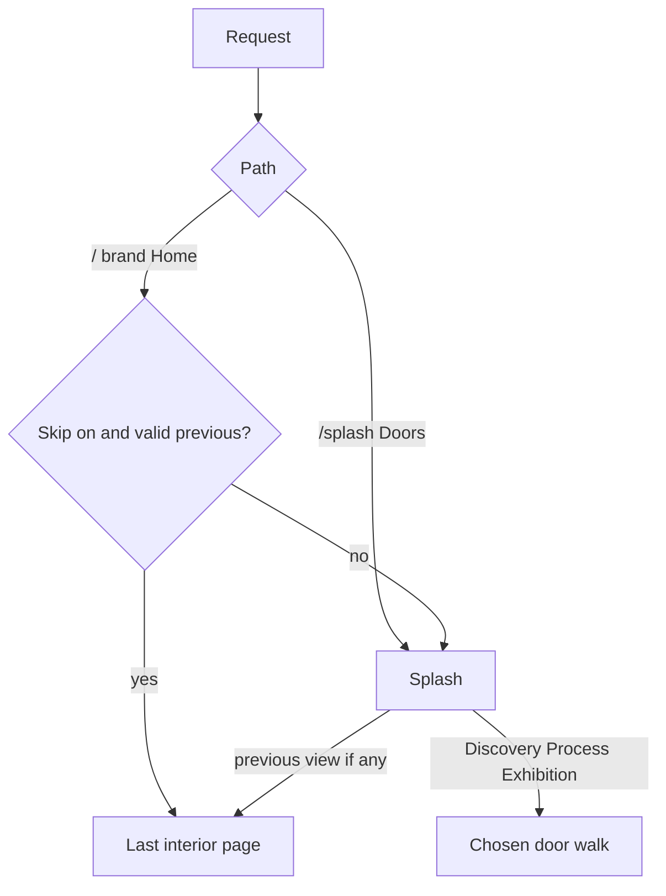
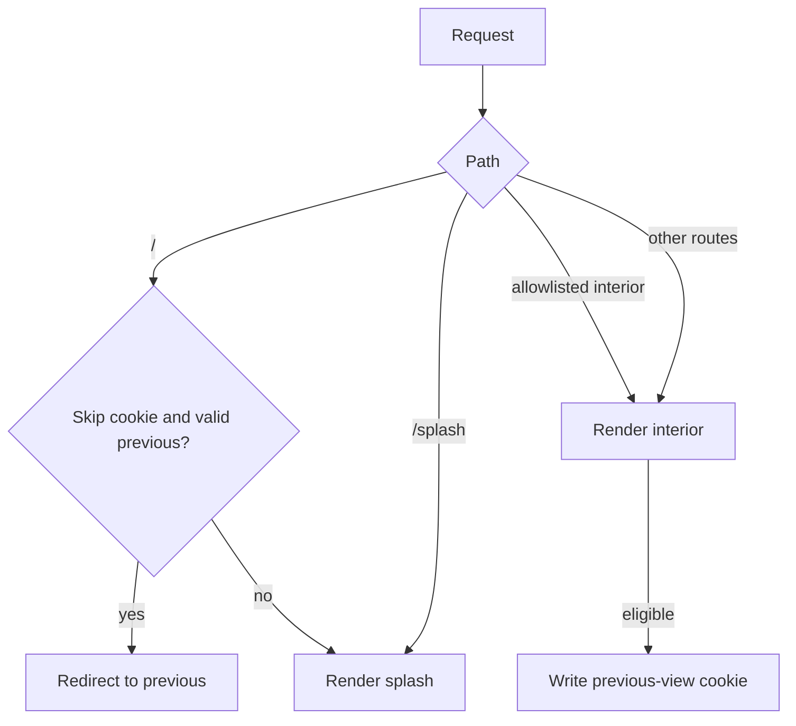

# Three-Door Splash - Plan

## Goal Capsule

**Objective:** Replace the home credential plaza with a view-only splash of three doors — Discovery, Process, Exhibition, in that order — plus resume-from-previous-view and skip-splash, while keeping the splash reachable as a view.

**Product authority:** `STRATEGY.md`. Peers view; no sell; work named by craft not employment history.

**Open blockers:** None.

**Stop:** Do not add a fourth Proof door. Do not put hire, CV, or conversation CTAs on the splash. Do not retitle existing case studies. Do not restyle Gallery into a full herbarium. Leave unrelated theme/color files untouched.

**Execution:** Native `ce-work`. Prove the journey-preference allowlist with unit tests before wiring routes. Prefer a failing preference/home spec before changing `index.vue`.

**Tail:** This plan’s files only. Do not stage `theme/core` color work, `.gitignore`, or `opencode.json` unless the user asks.

**Product Contract preservation:** restructured, no scope change: R14 names first-beat URLs; R2 previous-view is secondary; Outstanding Questions moved to KTDs.

<!-- ce-section: work-relationships -->

## How This Work Fits Together

This plan owns the splash, resume/skip, and which topics belong in each door.

The broader repositioning is the current understanding, not a committed roadmap:

- Quiet frame sitewide (nav, “Portfolio App”, CTAs off every page) — **Depends on** this splash existing as home; **Can proceed independently of** door interiors
- Herbarium hanging inside Exhibition — **Shares** the Exhibition door
- Kifu / wall text on artifacts — **Shares** the Process door
- Medium continuum interiors — **Shares** the Discovery door

---

## Product Contract

### Summary

Home is a splash with three doors in order: Discovery, Process, Exhibition. Proof of work is sorted into those doors, not a fourth. Returning visitors can continue from the last interior page, skip the splash on later home-style arrivals until they turn skip off, and still open the splash as a view whenever they want.

### Problem Frame

The live home asks peers to pick from a hiring lobby and an app sitemap. STRATEGY wants a journey they view. A splash of three modes is the fork; resume and skip keep the splash from blocking people who already know where they were.

### Key Decisions

- **Three doors, this order: Discovery, Process, Exhibition** (session-settled: user-directed — chosen over Discovery, Exhibition, Process: Process is a primary path, not a leftover journal). Governs R1, R4.
- **Proof is not a door** (session-settled: user-approved — chosen over a fourth Proof door: proof lives inside the three). Governs R5.
- **Work is named by craft, not employment history** (session-settled: user-directed — chosen over employer/job chapters: provenance footnotes only). Governs R6.
- **View-only; splash is not a sales gate** (session-settled: user-directed — chosen over hire/CV/mailto as home actions: no exchange other than viewing). Governs R7.
- **Resume previous view, skip splash, splash remains a view** (session-settled: user-directed — chosen over splash-every-time or splash-once-then-gone: returning visitors are not trapped, first-timers still meet the three doors). Governs R8, R9, R10.
- **Skip is a persistent preference** (review-settled: best-judgment — chosen over one-shot skip: “next visit” names the skip control; skip stays until the visitor turns it off, matching F4 and splash-as-a-view). Governs R9, F3, F4.
- **Eligible home arrivals honor skip; explicit splash does not** (review-settled: best-judgment — chosen over skip-on-every-`/` including splash URL: brand/Home and direct `/` that would show splash honor skip; dedicated splash view, browser back onto splash, and refresh on splash stay on splash). Governs R9, R10.

### Actors

- A1. First-time peer — no previous interior page, no skip preference.
- A2. Returning peer — has a previous interior page and/or a skip preference.
- A3. Returning peer who wants the splash again — skip may be on; they still open the splash as a view.
- A4. Returning peer checking current status — skip may be on; they still need a quiet cue to Discovery’s “what’s on view.”

### Requirements

**Splash**

- R1. The first home view is a splash whose primary choices are Discovery, Process, and Exhibition, in that order.
- R2. Each door starts a walk in that mode. On the splash, the only primary choices are the three doors. Previous-view is a secondary continue control when a valid interior exists. Sitewide nav remaining a sitemap is deferred with the quiet-frame sweep and does not violate this contract.
- R3. When a previous interior page exists, the splash also offers to start from that previous view.
- R4. Discovery is getting to know the work by walking it. Process is getting to know how Tamara thinks, decides, and learns. Exhibition is getting to know the work by looking at mounted specimens.

**Sorting**

- R5. Proof of work (operable artifacts, libraries as samples, recovery states) is assigned into Discovery, Process, or Exhibition per the topic map in this contract. It is not a peer of the three doors.
- R6. Labels this work introduces (splash doors, previous-view, skip, first-beat titles) are identified by medium, question, or artifact. Employers and roles may appear as provenance only. Sitewide retitling of existing case studies is deferred.

**View-only chrome on the splash**

- R7. While the splash view is on screen, splash content and primary document chrome omit availability-for-roles, Download CV, Get in touch / Start a conversation, and “Portfolio App” billing. Quiet-frame on other routes stays deferred.

**Resume and skip**

- R8. Choosing “previous view” opens the last interior page in Discovery, Process, or Exhibition. If there is no such page, or the remembered URL is missing or no longer a valid interior page, that choice is absent and the visitor sees the splash.
- R9. The visitor can choose to skip the splash on later home-style arrivals. Skip stays on until they turn it off. Direct `/` and brand/Home that would show the splash honor skip and go to the previous interior page (or the splash if none exists). Explicit “open splash,” a dedicated splash view, browser back onto the splash URL, and refresh while already on splash show the splash.
- R10. The splash remains a reachable view after skip. Skip does not delete the splash; it only changes the default next home-style landing.

**Topic map (door membership)**

- R11. Discovery holds: the medium continuum walk; case-study chapters as a walk; UI/UX you move through; operable proof that is a journey beat; a quiet “what’s on view” sense of current work.
- R12. Process holds: starting point → decision → result → learning beside the work; thought-process writing that does not dump into `/docs`; agent training / agent UI / approval-reject-fallback as judgment you can follow; UX architecture, standardization, and templating; the Lab as how a decision looks from the inside, not as a Lab product in chrome. Launch-meta (worktrees, withheld GitHub) is not a Process headline.
- R13. Exhibition holds: gallery as hanging (not a social feed); typed code/media/viz specimens; 3D/XR and creative media products; media libraries hung on the piece they belong to; gaming UI / visual manipulation as kinds of work.

**First beats, membership, accessibility**

- R14. Each door’s first destination in this increment is a walk beat, not Work / Process / Gallery as an app index. Discovery: `/work/media-systems`. Process: `/process#agentic-ui-exploration`. Exhibition: `/gallery?specimen=tesseract-framework-reel`. Case studies have no chapter routes; the Discovery “chapter” is that case-study page.
- R15. Each artifact has one canonical splash door. Kifu / proof may annotate other doors. Canonical assignment for the six case-study slugs: `media-systems` Discovery; `data-visualization` Discovery; `experience-systems` Discovery; `human-controlled-ai-lab` Process; `innovation-prototyping` Exhibition; `spatial-experiences` Exhibition.
- R16. Splash controls are semantic, keyboard-reachable, in Discovery → Process → Exhibition order for keyboard and screen readers, with visible focus, accessible names, and usable touch targets. Focus moves with the chosen destination after navigation.

### Key Flows

- F1. **First visit**
  **Trigger:** A1 opens the site with no previous interior page and no skip preference.
  **Covers R1, R3, R8.**
  They see the splash with Discovery, Process, Exhibition. Previous-view is absent. Picking a door starts that walk.

- F2. **Continue from previous**
  **Trigger:** A2 opens the splash and has a last interior page.
  **Covers R3, R8.**
  Previous-view is present. Choosing it opens that page without picking a door again.

- F3. **Skip splash on later home arrivals**
  **Trigger:** A2 opts to skip the splash, then later arrives via `/` or brand/Home.
  **Covers R9, R10.**
  They land on the previous interior page (or splash if none). Skip stays on until they turn it off. They can still open the splash as a view.

- F4. **Open splash as a view**
  **Trigger:** A3 wants the three-door fork again after skip or after walking a door.
  **Covers R10.**
  The splash is available as a destination. Opening it does not clear skip unless they change that preference.

- F5. **Current status without abandoning skip**
  **Trigger:** A4 has skip on and wants to know what is currently on view.
  **Covers R11, R9.**
  Home-style landing still honors skip. A quiet cue to Discovery’s “what’s on view” is available without forcing the splash or replacing previous-view.

### Acceptance Examples

- AE1. **First visit, no continue**
  **When** there is no previous interior page
  **Then** the splash shows Discovery, Process, Exhibition in that order and does not offer previous view
  **Covers R1, R3, R8.**

- AE2. **Continue**
  **When** the last page was an Exhibition specimen
  **Then** previous view is offered and choosing it returns to that specimen
  **Covers R3, R8.**

- AE3. **Skip then return**
  **When** skip is on and a previous interior page exists
  **Then** the next home-style arrival opens that page, not the splash
  **Covers R9.**

- AE4. **Splash still reachable**
  **When** skip is on
  **Then** the visitor can still open the splash as a view and see the three doors
  **Covers R10.**

- AE5. **No sell on splash**
  **When** a peer is on the splash
  **Then** splash content and primary document chrome have no CV download, no conversation CTA, no availability-for-roles pitch, and no “Portfolio App” billing
  **Covers R7.**

- AE6. **Craft not employer on new labels**
  **When** this work introduces a door, previous-view, skip, or first-beat label
  **Then** the label is the medium, question, or artifact, not the employer
  **Covers R6.**

- AE7. **Stale previous view**
  **When** the remembered URL is missing or not an interior door page
  **Then** previous-view is absent and the visitor sees the splash
  **Covers R8.**

- AE8. **First-time door beat**
  **When** a first-time peer picks a door
  **Then** they take one walk step in that mode (chapter, decision card, or hanging specimen), not an app index named Work, Process, or Gallery
  **Covers R2, R14.**

### Success Criteria

- A first-time peer who picks a door takes one walk step in that mode, not only names the three doors.
- A returning peer can get back to where they were without being forced through the splash.
- A returning peer can still choose to see the splash.
- A returning peer checking current status can reach Discovery’s “what’s on view” without abandoning skip.
- Peers do not meet a hire/CV pitch on the splash.

### Scope Boundaries

**In this plan:** splash, door order, topic membership, previous-view, skip (persistent preference), splash as a reachable view, view-only splash chrome.

**Deferred for later:** sitewide quiet-frame sweep beyond the splash; full herbarium visual restyle; kifu on every artifact; rewriting every case-study title for seniority drift.

**Outside this product's identity:** using the splash to sell, start collaboration, or transact; identifying work by employment history; Docs/Lab/Code IDE as splash doors.

### Assumptions

- Previous view means the last page inside Discovery, Process, or Exhibition on the same device. Eligible interiors are pages in those three walks only. About, Docs, Lab-as-product, Writing, and stack-tour URLs are not previous-view pages.
- How skip and previous view are remembered is a planning choice, as long as R8–R10 hold for a returning browser on the same device.
- `STRATEGY.md` still lists Proof as a track; this splash folds proof into the three doors. Later readers must not restore a fourth splash door from that track list.

### Outstanding Questions

None blocking. Planning resolutions are KTD1–KTD6.

### Sources

- `STRATEGY.md` — view-only, craft not history, tracks.
- `docs/ideation/2026-09-14-likwidmack-view-only-journey-ideation.html` — trailhead, hanging, quiet frame, kifu.
- Live mismatch: `core/web/content/home.json` (availability, CV, conversation); `core/web/content/gallery.json` (social feed); `core/web/app/components/AppPrimaryNav/index.vue` (Work/About/Gallery/Writing/Code).

---

## Planning Contract

### Key Technical Decisions

- KTD1. Persist skip and previous-view in same-site cookies readable on the server (chosen over `localStorage` like `usePersonalization`: that pattern hydrates on `onMounted` and would flash the splash on `/`). Prefix keys like existing `tgmc-*` prefs. Set `path: '/'` and a long `maxAge` (one year). If cookies are blocked, treat as no preference and show the splash. Governs R8, R9. Nuxt 4 `useCookie` plus **route middleware on `/` only** (`core/web/app/middleware/`), not Nitro `server/middleware`.
- KTD2. Dedicated splash route `/splash` always renders the splash (chosen over `/?view=splash`: refresh and back-stack stay on splash per R9). Brand Home stays `/` and honors skip. Governs R9, R10, F4.
- KTD3. First-beat URLs this increment (chosen over inventing chapter routes or a herbarium): Discovery `/work/media-systems`; Process `/process#agentic-ui-exploration`; Exhibition `/gallery?specimen=tesseract-framework-reel`. Process cards get `id` attributes and a stable secondary sort by `id`. Gallery keeps the default grid, highlights the named specimen, and focuses that control; do not switch to feed/`openInFeed`. Full hanging restyle stays deferred. Governs R14, AE8.
- KTD4. Skip control is a persistent checkbox on the splash, below the doors, after previous-view when present. Label names the skip, not an employer. Unchecking turns skip off. Omit skip and previous-view when cookies are unreadable. Governs R9, R6, F3.
- KTD5. When skip is on, menu item **Doors** links to `/splash`. When skip is off, brand Home is the splash entry; do not add Doors. Do not hide Work/About/Gallery/Writing/Code this increment. Governs R10, R2.
- KTD6. When skip is on, **On view** is a header-actions text link to `/work/media-systems` (accessible name: On view: Media Systems), not icon-only and not inside Menu. It does not replace previous-view or force `/splash`. That slug is this increment’s “what’s on view.” Governs F5, R11.

### High-Level Technical Design

Arrival and preference:

Do not remember `/`, `/splash`, `/work`, `/gallery` without `specimen`, `/process` without a card hash, `/about`, `/docs`, `/ai-lab`, `/blog`, `/code`, `/product`, `/styles`, `/media-player`, `/cdn-test`.

### Implementation Constraints

- Shared preference helpers must be importable from Nuxt **route** middleware. Do not import `@tgmc/utilities/browser`. Do not put this preference in Nitro `server/middleware` (`useCookie` is not available there).
- Write previous-view on the **client** from `route.fullPath` so Process hashes are stored. `/` skip-read stays middleware. Never derive previous-view from the server request path.
- `core/web` page tests mostly assert source/content strings. Match that style for home/nav; put allowlist logic in `core/web/shared/` with a dedicated spec.
- `core/web/tests/home-page.spec.ts` currently asserts plaza copy, featured slugs, and `AppWorkCard`. Rewrite those assertions to the splash contract.
- `site` layout always mounts `AppPrimaryNav`. Splash chrome is a route-aware hide, not a new layout family.

### Sequencing

U1 → U4 and U2 in either order after U1 → U3 → U5. U5 needs splash route identity from U2/U3.

### Assumptions

- Cookie persistence is same-device, same-site. No account sync.
- “On view” this increment is the Discovery first beat, not a live editorial feed.
- Exhibition first beat may still sit in the existing gallery page; feed chrome restyle is deferred. The specimen query is the walk step.
- Scoping bets from planning: cookies not localStorage; `/splash` not a query flag; Process first card is `agentic-ui-exploration` (pairs with canonical Process slug `human-controlled-ai-lab`).

### Deferred to Follow-Up Work

- Sitewide quiet-frame (Get in touch / Portfolio App / hire CTAs on non-splash routes).
- Full herbarium hanging and kifu on every artifact.
- Case-study title rewrite; chapter routes inside `/work/{slug}`.
- Capturing a `docs/solutions/` learning for cookie skip vs personalization FOUC after this ships.

### Risks

- Gallery first beat still looks like a social feed. Mitigation: specimen query + focus is the increment; do not expand into herbarium.
- Cookie + middleware is new in this app. Mitigation: unit-test allowlist and skip policy; middleware stays thin.
- `home-page.spec.ts` and `gallery-page.spec.ts` will fail until updated. Mitigation: change specs in the same units as the UI.

---

## Implementation Units

### U1. Journey preference module

**Goal:** Encode skip, previous-view, and interior allowlist so `/` can honor skip without guessing URLs.

**Requirements:** R8, R9, R10, AE1, AE3, AE7. Product Key Decision: resume/skip/splash-as-view.

**Dependencies:** None.

**Files:**

- Create `core/web/shared/journey-preference.ts`
- Create `core/web/tests/journey-preference.spec.ts`

**Approach:**

1. Export path eligibility, skip flag parse, and “effective landing” (splash vs previous) as pure functions.
2. Treat missing, malformed, or non-allowlisted previous paths as no previous view.
3. Do not record splash or excluded routes.

**Patterns to follow:** `core/web/shared/personalization.ts` for `tgmc-*` naming; keep this module free of `window` / `localStorage`.

**Execution note:** Write the allowlist and skip-policy tests first.

**Test scenarios:**

- Covers AE1. Empty cookies → landing is splash; previous-view absent.
- Covers AE3. Skip on + `/gallery?specimen=tesseract-framework-reel` → home landing is that path.
- Covers AE7. Skip on + `/about` or `/docs/foo` as previous → landing is splash; previous hidden.
- `/work` index, `/gallery` without specimen, `/process` without hash → not eligible.
- `/work/media-systems`, `/process#agentic-ui-exploration`, `/gallery?specimen=tesseract-framework-reel` → eligible.
- Cookies blocked / unreadable → splash.

**Verification:** Spec file covers every allowlist class above. No Vue mount required.

### U2. Splash view and home content

**Goal:** Replace the credential plaza with the three-door splash on `/` when skip does not redirect.

**Requirements:** R1, R2, R3, R4, R6, R16, F1, F2, AE1, AE2, AE6, AE8.

**Dependencies:** U1.

**Files:**

- Modify `core/web/app/pages/index.vue`
- Modify `core/web/app/pages/index.scss`
- Modify `core/web/content/home.json`
- Modify `core/web/content.config.ts` (home schema)
- Create `core/web/app/pages/splash.vue` (or shared splash component used by both `/` and `/splash`)
- Modify `core/web/tests/home-page.spec.ts`

**Approach:**

1. Heading/lede, then three sequential door **links** (not identical icon-cards) in Discovery → Process → Exhibition order, each showing the door name plus its R4 one-line mode sentence, hrefs per KTD3. U4 independently implements destination behavior; AE8 is green only after U4.
2. Previous-view is a secondary continue control after the doors, labeled with the destination’s medium/artifact title (not a fourth door, not the raw path), only when U1 says a path exists.
3. Skip checkbox last per KTD4. If U1 reports cookies blocked, omit previous-view and skip; doors only.
4. Remove availability, Download CV, Start a conversation, and featured-work plaza from the splash surface.
5. New labels use medium/question/artifact language only.
6. R16: labeled list of door links; previous-view and skip keyboard-reachable after doors in visual order; visible focus rings; accessible names; door hit areas at least 44px (stack on small viewports). After door or previous-view navigation, move focus to the destination beat (case-study h1, hashed process card, or gallery specimen control).

**Patterns to follow:** Content-driven copy via `home.json` + Zod in `content.config.ts`, like the current home page.

**Test scenarios:**

- Covers AE1. Home source/content lists Discovery, Process, Exhibition in that order and has no previous-view copy when preference is empty.
- Covers AE2. When previous path is an Exhibition specimen, splash offers previous-view pointing at that path, not presented as a peer door.
- Covers AE6. Splash labels do not contain employer names.
- Covers AE8. Door hrefs are the KTD3 beats, not `/work`, `/process`, or `/gallery` indexes.
- Home content no longer contains availability pitch, Download CV, or Start a conversation.
- R15 canonical doors for the six slugs are assignment-only this increment except the three KTD3 first beats.
- Cookies blocked: skip control and previous-view absent.

**Verification:** `home-page.spec.ts` matches splash contract. Splash has no hire/CV strings.

### U3. Arrival routing and remember interiors

**Goal:** `/` honors skip on the first HTML response. `/splash` always shows splash. Eligible interiors update previous-view.

**Requirements:** R8, R9, R10, F3, F4, AE3, AE4.

**Dependencies:** U1, U2.

**Files:**

- Create Nuxt route middleware under `core/web/app/middleware/` (or equivalent `/` page server redirect using cookies)
- Modify `core/web/app/pages/index.vue` / `splash.vue` as needed
- Modify or create `core/web/tests/` coverage for eligibility + middleware policy (string or unit)

**Approach:**

1. On `/`, if skip is on and previous is valid, redirect to previous. Otherwise render splash.
2. `/splash` never redirects for skip.
3. After client navigation to an eligible interior, write the previous-view cookie from `route.fullPath` (hash included). Do not write from the Nitro request path.
4. Brand Home remains `to="/"` in `AppPrimaryNav`.

**Patterns to follow:** None in-app for `useCookie`; follow Nuxt 4 cookie + named **route** middleware on `/` only. Keep middleware a thin call into U1.

**Test scenarios:**

- Covers AE3. Skip on + valid previous → `/` policy is redirect to previous, not splash.
- Covers AE4. Same cookies → `/splash` policy is render splash.
- Direct `/work/media-systems` is never intercepted.
- Visiting `/about` does not overwrite a valid previous view.
- Visiting `/` or `/splash` does not write those paths as previous view.
- After `/process#agentic-ui-exploration`, stored previous-view includes the hash (client `fullPath`, not the server path).

**Verification:** Policy tests pass. Manual or future e2e can confirm no splash flash; unit tests prove the redirect decision is cookie-driven, not `onMounted`.

### U4. Door first beats on existing surfaces

**Goal:** Process and Exhibition destinations are walk beats, not indexes.

**Requirements:** R14, R13, AE8.

**Dependencies:** None (can land before U2; U2 consumes the URLs).

**Files:**

- Modify `core/web/app/pages/process/index.vue`
- Modify `core/web/app/pages/gallery/index.vue`
- Modify `core/web/tests/gallery-page.spec.ts`
- Create `core/web/tests/process-page.spec.ts` (card `id` + date-then-`id` sort)
- Modify `core/web/tests/work-page.spec.ts` only if nav assertions change

**Approach:**

1. Give each public decision card a DOM `id` matching `card.id`. Stable-sort by date then `id`.
2. Honor `#agentic-ui-exploration` as the Process first beat (native fragment scroll once the DOM `id` exists).
3. On `/gallery?specimen=`, keep the default grid. Highlight the matching exhibit and move keyboard focus to that control. Give grid exhibits a stable focus target for the named id (do not depend on feed-only `post-${id}` or `openInFeed`). If the id is missing or unknown, render the gallery as usual with no highlight and no crash. Do not add a single-specimen layout, wall text, or feed-chrome removal.
4. Discovery door uses existing `/work/media-systems`.

**Patterns to follow:** `isPublicDecisionCard` on process; gallery exhibit ids in content JSON.

**Test scenarios:**

- Covers AE8. Process markup includes `id="agentic-ui-exploration"` on the public card.
- Covers AE8. Gallery reads `specimen` query, stays in grid, and targets the named exhibit control.
- Public cards with the same date sort deterministically by `id`.
- Unknown `specimen` does not crash; gallery still renders with no highlight.

**Verification:** Process and gallery specs cover ids/query. Splash door hrefs in U2 match these beats.

### U5. Splash chrome, Doors, and On view

**Goal:** While splash is on screen, hide sell chrome. From interiors, reopen splash and reach current work without abandoning skip.

**Requirements:** R7, R10, R11, F4, F5, AE4, AE5. Product Key Decision: view-only splash.

**Dependencies:** U2, U3.

**Files:**

- Modify `core/web/app/components/AppPrimaryNav/index.vue`
- Modify `core/web/shared/site-profile.ts` usage for document title on splash routes (or page `usePortfolioSeo` / `useHead`)
- Modify `core/web/content/profile.json` only if a splash-specific title is required; prefer route-local title without renaming `titleSuffix` globally
- Modify `core/web/tests/work-page.spec.ts` (nav assertions) and `core/web/tests/home-page.spec.ts`

**Approach:**

1. On `/` splash and `/splash`, omit Get in touch from primary nav. Omit “Portfolio App” from the document title.
2. When skip is on, add Doors → `/splash` in the menu panel per KTD5. When skip is off, omit Doors; brand Home is the splash entry.
3. When skip is on, show On view in the header actions row per KTD6.
4. Leave hire CTAs on About/Gallery interiors; that is deferred quiet-frame.

**Patterns to follow:** Route-aware nav already uses `useRoute()` in `AppPrimaryNav`. Title helper in `site-profile.ts` (`DEFAULT_APP_TITLE`).

**Test scenarios:**

- Covers AE5. Splash route source has no Get in touch in nav; document title does not include Portfolio App.
- Covers AE4. When skip is on, nav includes Doors to `/splash`.
- Covers F5. Skip-on state exposes header On view to `/work/media-systems`.
- Skip off: Doors and On view absent.
- Non-splash routes still list Get in touch this increment.

**Verification:** Nav/home specs assert splash vs interior chrome. About/Gallery hire CTAs unchanged.

---

## Verification Contract

Prove the splash contract with `@tgmc/web` vitest, not a full Nuxt e2e pass, unless an implementer already has the app on :4200.

- `cd core/web && npm run test -- tests/journey-preference.spec.ts tests/home-page.spec.ts tests/process-page.spec.ts tests/gallery-page.spec.ts tests/work-page.spec.ts`
- Root `npm test` before push (husky pre-push).
- Browser check after UI lands: first visit splash doors; skip then brand Home; `/splash` still splash; Process hash and gallery specimen; splash has no CV/mailto.

`release:validate` does not apply. No behavioral skill eval.

---

## Definition of Done

- R1–R16 that this increment implements are met (R11–R13 membership is assignment + first beats, not a full interior rewrite).
- Every unit’s test scenarios pass.
- Abandoned experiments are not left in the diff.
- Unrelated dirty files (for example the Sass `_colors.scss` rewrite) are not in the commit. Typed `@tgmc/theme` helpers (`color-palette.ts`, `color-quality.ts`, barrel exports, and their tests) may ship when they support splash/journey contracts.
- Docs: this plan stays the source of truth; no extra marketing copy.

**Per unit:** U1 allowlist complete; U2 plaza gone; U3 `/` skip without client-only preference; U4 beats exist; U5 splash chrome + Doors + On view.

---

## System-Wide Impact

- New cookies on the public site (preference only, not auth). Same-site, not secrets.
- Document title and primary nav become route-aware on splash.
- Home SEO copy in `home.json` must stay view-only; do not keep availability in `seo.description`.

## Sources & Research

- Repo patterns: `core/web/app/pages/index.vue`, `core/web/content/home.json`, `core/web/app/composables/usePersonalization.ts` (localStorage FOUC — rejected for skip), `core/web/app/layouts/site.vue`, `core/web/app/components/AppPrimaryNav/index.vue`.
- No `docs/solutions/` corpus. No in-app `useCookie` examples; cookie skip is new infra on Nuxt 4.5.
- External research skipped: page/content patterns are local; cookie API is Nuxt-standard, not an unsettled option set.
- Spec-flow analysis ran in the planning session (same context): cookies disabled, index URLs, and non-intercept of direct interiors are encoded in U1/U3 tests.
