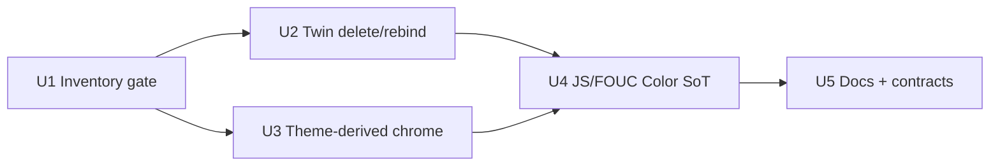

# Portfolio Theme Variable Cleanup - Plan

## Goal Capsule

**Objective:** Reduce SCSS/JS color SoT overhead between `core/web` and `@tgmc/theme` by measuring duplicates first, deleting proven twins, deriving remaining `--portfolio-*` chrome from theme, and making theme `Color` the only runtime color SoT for personalization.

**Product authority:** App styling hygiene + theme package consumption. Extends shipped color-fns / brand-role work (`docs/plans/2026-09-18-001-feat-theme-scss-color-fns-plan.md`). Visual redesign of brand or Personalize UX is not active scope.

**Open blockers:** None.

**Stop:** Do not promote haze/particle/rose into `@tgmc/theme` as public tokens. Do not redesign Personalize UX. Do not bulk-rewrite theme hand-tuned role hexes. Do not run a multi-iteration ce-optimize loop as the delivery vehicle.

**Execution profile:** Smoke-first styling/config work with contract tests. Prefer inventory gate before SCSS deletes; verify FOUC string + personalization behavior after JS SoT changes.

**Product Contract preservation:** Product Contract unchanged (requirements, KD1–KD4, flows, AEs preserved). Planning resolved Deferred Q1–Q3 as KTD1–KTD3 below.

---

## Product Contract

### Summary

Inventory duplicate color sources of truth across web and theme, then cut only proven overlaps. Keep `--portfolio-*` names for app chrome, but stop owning raw hex in web for those tokens. Finish by wiring FOUC, brand tokens, and remaining app color maps so `@tgmc/theme` `Color` / theme CSS vars are the sole color SoT.

### Problem Frame

App `_variables.scss` still declares hex for teal, ivory, ink, rose, haze, and particles while theme already owns brand, surface, success, and accent CSS vars plus Sass `theme-*` helpers and JS `Color`. Parallel SoTs force double edits, drift light/dark, and fight the documented rule that app props are `--portfolio-*` bridges—not a second palette. Personalization already uses `Color` for brand roles, but FOUC and residual maps can still diverge from theme.

### Requirements

**Measurement**

- R1. Before deleting or rebinding any token, produce a measurable inventory of duplicate color SoTs between `core/web` (SCSS + relevant TS color maps) and `@tgmc/theme` (CSS custom properties, Sass tokens, `Color` / `themeColors` exports).
- R2. Inventory reports at least: duplicate count (or equivalent), and `scss_lines` for the scoped app tree so before/after cost is comparable. (Covers CONCEPTS `scss_lines`.)

**SCSS cleanup**

- R3. Delete or rebind `--portfolio-*` (and parallel SCSS hex) only when inventory proves a theme twin already exists; call sites must consume theme CSS vars and/or Sass tokens thereafter.
- R4. Keep `--portfolio-*` names for chrome that has no public theme twin today (haze, particles, rose / rose-strong, and similar atmosphere tokens); define them via theme Sass helpers and/or `Color` mixes — no raw hex SoT in `core/web` for those tokens.
- R5. Preserve the documented bridge rules: app props stay `--portfolio-*`; do not shadow theme layout/space/brand role names; `--portfolio-coral` continues to alias accent for FOUC / personalization. (Covers CONCEPTS Portfolio CSS variables.)

**JS parity**

- R6. Theme package `Color` (and related theme color exports) is the only color SoT for FOUC bootstrap, `buildBrandTokens`, brand-role resolution, and any remaining app-owned color maps that duplicate theme.
- R7. Personalization behavior stays the same for users (brand-role harmony, overrides, storage keys); only the wiring/SoT changes.

**Docs & verification**

- R8. Update living docs (`docs/web/features/app-scss.md`, `docs/web/features/personalization.md`, and theme docs as needed) so agents and humans know: inventory gate, delete-only-proven-twins, theme-derived chrome, and JS SoT rule.
- R9. Automated tests cover: inventory/gate contract (or recorded baseline script), SCSS bridge expectations (no forbidden hex SoT patterns in web variables for cleaned tokens), and personalization/FOUC token application still resolving through theme `Color`.

### Key Decisions

- **KD1. Measure, then delete.** Inventory before cut; do not bridge-first or promote chrome into the theme public API in this plan. `(session-settled: user-directed — chosen over alias-only, delete-without-measure, and promote-chrome: measurable safe cut)`  
  Governs R1, R2, R3.
- **KD2. Full JS parity in the same work unit.** FOUC, brand tokens, and residual maps must leave theme as the sole color SoT — not SCSS-only. `(session-settled: user-directed — chosen over SCSS-only and shared-Color-reads-only: complete SoT collapse)`  
  Governs R6, R7.
- **KD3. Theme-derived chrome, keep names.** `--portfolio-haze-*` / particles / rose stay app-named; values come from theme mixes, not web hex and not new theme package chrome exports. `(session-settled: user-directed — chosen over keep-hex-in-web and promote-into-theme: names stay, hex leaves web)`  
  Governs R4, R5.
- **KD4. Approach A — inventory gate, then cut.** Formal measure gate precedes delete/rebind and JS parity phases. `(session-settled: user-approved — chosen over bridge-first and theme-owns-chrome)`  
  Governs R1–R9.

### Actors

- **A1. Theme author / agent** — changes tokens in `@tgmc/theme` and expects web to consume, not re-own hex.
- **A2. App stylist / agent** — edits `--portfolio-*` bridges and launch/page SCSS without introducing parallel palettes.
- **A3. Portfolio visitor** — sees unchanged personalization behavior (roles, overrides, FOUC-safe first paint).

### Key Flows

- **F1. Inventory → gate → cut (A1/A2).** Run inventory → review proven twins → delete/rebind SCSS → derive chrome → verify `scss_lines` / duplicate count improve or stay intentional.
- **F2. JS SoT alignment (A1/A2/A3).** Point FOUC / `buildBrandTokens` / maps at theme `Color` → smoke Personalize + first paint → confirm storage and harmony behavior unchanged (R7).

### Acceptance Examples

- **AE1.** Covers R1, R2, R3. Given inventory lists `--portfolio-teal` as a twin of theme success (or the documented theme twin), when cleanup runs, web no longer owns that hex and call sites resolve through theme.
- **AE2.** Covers R4. Given `--portfolio-haze-1` has no public theme twin, when cleanup runs, the name remains `--portfolio-haze-1` and its value is a theme-derived mix with no raw hex in web `_variables.scss`.
- **AE3.** Covers R6, R7. Given a visitor with saved brand roles, when FOUC and Personalize apply tokens after cleanup, first paint and role harmony match pre-cleanup behavior and use theme `Color` for resolution.

### Scope Boundaries

**In**

- Duplicate inventory / gate metrics for web↔theme colors
- Delete/rebind proven SCSS twins; theme-derived `--portfolio-*` chrome
- Full JS color SoT parity (FOUC, brand tokens, residual maps)
- Docs + tests for the above

**Out**

- Promoting haze/particle/rose into `@tgmc/theme` as first-class public tokens
- Visual redesign of brand, Personalize UI, or landing chrome
- Bulk rewrite of theme hand-tuned role hexes (already constrained by prior color-fns plan)
- Unrelated page layout polish unless required to keep styles compiling after renames

### Deferred to Follow-Up Work

- Optional durable CI check that fails on new raw hex SoTs under `core/web/assets/css/_variables.scss` after this cleanup lands
- Broader `scss_lines` optimize loop for non-color stylesheet dedupe (mixin/globals) — separate from color SoT collapse

### Outstanding Questions

**Resolved in Planning Contract**

- Q1. Inventory harness → KTD1 (extend `scripts/measure-app-scss.mjs`).
- Q2. Twin mapping table → KTD2 (locked starter map + inventory-proven extras).
- Q3. FOUC Color import → KTD3 (build-time `Color` into inline IIFE; no runtime Color in head).

### Sources

- Dialogue 2026-09-19: measure→delete, full JS parity, theme-derived chrome, Approach A
- `docs/plans/2026-09-18-001-feat-theme-scss-color-fns-plan.md` (shipped color-fns / brand harmony)
- `docs/web/features/app-scss.md`, `docs/web/features/personalization.md`, `CONCEPTS.md`
- `docs/solutions/architecture-patterns/app-scss-variables-globals-mixin-selector-split.md`
- Current surfaces: `core/web/assets/css/_variables.scss`, `theme/core/scss/globals/_root.scss`, `theme/core/scss/tokens/_colors.scss`, `core/web/shared/personalization.ts`, `scripts/measure-app-scss.mjs`, theme `Color` / `themeColors`

---

## Planning Contract

### High-Level Technical Design

**Ownership after cleanup**

| Concern                                   | Owner                              | App form                                                         |
| ----------------------------------------- | ---------------------------------- | ---------------------------------------------------------------- |
| Brand / success / surface / accent        | `@tgmc/theme` CSS + Sass + `Color` | `--portfolio-*` bridges via `var(--theme-*)` or delete if unused |
| Atmosphere chrome (haze, particles, rose) | Theme mixes at compile time        | Keep `--portfolio-*` names; no raw hex in web                    |
| User brand roles / FOUC                   | Theme `Color` at build + client    | Inline IIFE hex from `Color`; client `buildBrandTokens`          |

### Key Technical Decisions

- KTD1. Extend `scripts/measure-app-scss.mjs` (and SoT tests) with a `duplicate_color_sot` metric rather than a new inventory-only script or a ce-optimize experiment loop. `(session-settled: user-approved — chosen over new script and ce-optimize loop: reuse existing measure gate)`  
  Resolves Q1. Governs R1, R2.
- KTD2. Starter twin map (inventory may add proven rows; must not invent coral as a static theme hex twin). Inventory must also flag web **re-declarations** of theme-emitted `--portfolio-*` / success vars, not only hex equality:
  - `--portfolio-teal` ↔ theme success / `$portfolio-teal-dark` (`#1b7a7a`) and `$portfolio-teal-light` (`#146060`) — both mode hexes are twins
  - Surface/background roles: light `--portfolio-ivory` ↔ `$main-background-light`; dark `--portfolio-ivory` ↔ `$main-background-dark` (semantic flip of the **name**, not a single hex twin)
  - Text/ink role: dark `--portfolio-ink` ↔ theme text ink (`#f2ece8` / `$text-color-dark` / equivalent) — **not** `$main-background-dark` and **not** `$ink-*` Sass greys
  - Light `--portfolio-ink` ↔ `$main-background-dark` (`#0f0908`) as the dark paper used for “ink” in light mode
  - `--portfolio-coral` ↔ `var(--accent-color)` only (already bridged; keep fallback policy intentional)  
    `(session-settled: user-approved — coral stays accent bridge)`  
    Resolves Q2. Governs R3, R5.
- KTD3. FOUC remains an inline `<head>` IIFE from `buildPersonalizationFoucScript()`. The IIFE string may contain only **embedded hex/literals** produced via theme `Color` (and shared pack helpers) at **module evaluation / generation time** — no dynamic theme load inside `<head>`. The `personalization.ts` module may still import `Color` for generation and for client `buildBrandTokens`. Align FOUC-applied vars with `buildBrandTokens` where safe (e.g. include `--button-fg` when that preserves R7). `(session-settled: user-approved — build-time Color, not runtime in head)`  
  Resolves Q3. Governs R6, R7.
- KTD4. Theme-derived chrome uses Sass `@use` of theme tokens / `theme-*` helpers inside `core/web/assets/css/_variables.scss` (via existing Sass `loadPaths`), not duplicated hex literals. Prefer mixes from brand/surface/oxblood-adjacent theme tokens already in package. Governs R4.
- KTD5. Prefer rebinding call sites to `var(--…)` theme CSS custom properties when twins exist on `:root`; use Sass token values only when a CSS var is missing or semantic mapping requires compile-time mix. Governs R3.

### Assumptions

- A1. Theme already emits enough CSS vars for teal/success and main-background roles in light/dark; inventory will confirm before deletes.
- A2. Extending `measure-app-scss.mjs` is allowed for this feature (comment at top says do not modify during ce-optimize experiments — this plan is not that loop).
- A3. Slight visual drift from theme-derived haze/particle mixes is acceptable if names and relative hierarchy remain; no pixel-perfect pin to old hex required.

### Sequencing

1. U1 — inventory + baseline metrics
2. U2 — delete/rebind proven twins (depends U1)
3. U3 — theme-derived chrome (depends U1; parallel with U2 after map locked)
4. U4 — JS/FOUC Color SoT (depends U2 for coral/accent consistency; may start after U1 for pack hex)
5. U5 — docs + final contract assertions (depends U2–U4)

### Implementation Constraints

- Do not shadow theme token names from app variables except documented bridges (coral → accent).
- Do not `@use` `_globals.scss` from pages.
- Never discard unrelated WIP; stage only files for this work.
- Leave `.env.admin` untracked.

---

## Implementation Units

### U1. Inventory gate and baseline metrics

**Goal:** Measurable duplicate-SoT inventory plus `scss_lines` before any delete.

**Requirements:** R1, R2, KD1, KD4, KTD1

**Dependencies:** None

**Files:**

- Modify: `scripts/measure-app-scss.mjs`
- Modify: `core/web/tests/app-scss-sot.spec.ts` (or new focused spec if cleaner)
- Test: `core/web/tests/app-scss-sot.spec.ts`

**Approach:**

1. Add a `duplicate_color_sot` (or equivalent) metric that compares web `_variables.scss` / personalization hex constants against theme token hex / documented CSS var aliases using the KTD2 starter map plus any inventory-discovered exact hex matches.
2. Keep existing `scss_lines` and `contract_tests_passed` output.
3. Record baseline JSON (or test snapshot of metric shape) so U2/U5 can assert improvement or intentional holds.
4. Document coral as non-static-twin in the harness comments.

**Execution note:** This is mostly packaging/measure; prefer running the measure script + SoT tests over new unit suites for the metric itself.

**Patterns to follow:** Existing `scripts/measure-app-scss.mjs` JSON emit; `docs/solutions/architecture-patterns/app-scss-variables-globals-mixin-selector-split.md` measure-before-keep guidance.

**Test scenarios:**

- Happy path: measure script emits numeric `scss_lines` and `duplicate_color_sot` (or listed duplicates) without error.
- Edge: coral/accent bridge is not counted as a false “theme primary hex” twin.
- Covers AE1 inventory half: teal listed as a proven twin when hex matches theme success / `$portfolio-teal-*`.

**Verification:** Running `node scripts/measure-app-scss.mjs` prints JSON including both metrics; SoT tests still pass.

---

### U2. Delete or rebind proven SCSS twins

**Goal:** Remove web hex SoTs for inventory-proven twins; call sites use theme vars/tokens.

**Requirements:** R3, R5, KD1, KTD2, KTD5

**Dependencies:** U1

**Files:**

- Modify: `core/web/assets/css/_variables.scss`
- Modify: call sites under `core/web/` that hardcode twin hex or assume web-owned teal/ivory/ink literals (e.g. tests asserting hex)
- Modify: `core/web/tests/app-scss-sot.spec.ts`
- Test: `core/web/tests/app-scss-sot.spec.ts`, `core/web/tests/about-page.spec.ts` (if it asserts `--portfolio-teal` source shape)

**Approach:**

1. For each proven twin from U1/KTD2, replace web hex with `var(--…)` theme CSS properties or Sass `$` tokens via `@use`, preserving light/dark semantic ivory/ink flip.
2. Keep `--portfolio-coral: var(--accent-color, …)` bridge; fallback hex only if still required for FOUC ordering — prefer theme accent default once U4 lands.
3. Update SoT tests to forbid raw hex for cleaned twin names in `_variables.scss`.

**Patterns to follow:** `docs/web/features/app-scss.md` naming rules; existing coral → accent bridge.

**Test scenarios:**

- Covers AE1: after cleanup, `_variables.scss` has no `#1b7a7a` / `#146060` SoT for teal; `--portfolio-teal` resolves via theme.
- Happy path: light and dark `html[data-theme]` still invert ivory/ink roles correctly (surface vs text semantics per KTD2).
- Edge: both teal mode hexes (`#1b7a7a` and `#146060`) are absent as web SoT after rebind.
- Error/regression: about/page styles that reference `--portfolio-teal` still compile and resolve.

**Verification:** `duplicate_color_sot` drops for twin rows; visual smoke of home/about in light and dark; SoT tests green.

---

### U3. Theme-derived portfolio chrome

**Goal:** Keep haze/particle/rose `--portfolio-*` names; remove raw hex SoT by deriving from theme.

**Requirements:** R4, KD3, KTD4

**Dependencies:** U1

**Files:**

- Modify: `core/web/assets/css/_variables.scss`
- Optionally modify: `core/web/assets/css/portfolio-launch.scss` if chrome consumers need Sass context
- Test: `core/web/tests/app-scss-sot.spec.ts`

**Approach:**

1. `@use` theme tokens / `theme-*` helpers in `_variables.scss`.
2. Redefine `--portfolio-haze-*`, `--portfolio-particle-*`, `--portfolio-rose`, `--portfolio-rose-strong`, `--portfolio-grid-glow` (and other inventory-flagged atmosphere tokens) as mixes from theme brand/surface/oxblood-adjacent tokens — no `#…` literals for those names in web.
3. Keep `--portfolio-space` as a layout clamp (non-color); out of color SoT scope unless it wrongly holds hex.

**Patterns to follow:** Theme `theme-add-alpha` / `theme-adjust-lightness` usage from color-fns plan; CONCEPTS Theme-derived chrome.

**Test scenarios:**

- Covers AE2: `--portfolio-haze-1` name remains; no raw haze hex in `_variables.scss`.
- Happy path: dark theme haze ladder still progresses (relative lightnesses), even if absolute hex differs.
- Edge: particle shadow tokens that used rgba may use `color-mix` / `theme-add-alpha` instead of hardcoded rgba hex.

**Verification:** Launch sheet compiles; portfolio chrome pages render without missing var fallbacks; SoT forbids hex for chrome names.

---

### U4. JS / FOUC Color SoT parity

**Goal:** Theme `Color` is the only color SoT for FOUC bootstrap, `buildBrandTokens`, and residual app color maps.

**Requirements:** R6, R7, KD2, KTD3

**Dependencies:** U2 (accent/coral consistency); U1 for awareness of `PORTFOLIO_IVORY` / `PORTFOLIO_INK` constants

**Files:**

- Modify: `core/web/shared/personalization.ts`
- Modify: `core/web/services/color/colors.ts` if it still duplicates theme maps
- Possibly modify: `core/web/config-properties/app-prop.ts` (only if FOUC wiring needs comment/docs)
- Test: `core/web/tests/personalization.spec.ts`
- Test: `theme/core/tests/color-facade.spec.ts` only if new Color API surface is required (prefer reuse)

**Approach:**

1. Ensure `BRAND_PACKS` / defaults / FOUC embedded hex come from `Color` (or theme exports) at module load — not hand-copied hex parallel to theme.
2. Replace `PORTFOLIO_IVORY` / `PORTFOLIO_INK` (and similar) with theme `themeColors` / `Color.get` / shared constants from `@tgmc/theme` when they duplicate main-background roles.
3. Keep FOUC as string IIFE; assert generated script still sets brand role CSS vars before paint.
4. Prefer FOUC/`buildBrandTokens` parity for `--button-fg` when it does not break R7.
5. Do not change storage keys (`tgmc-brand-roles`) or harmony override rules.

**Execution note:** Implement FOUC generation changes test-first via `personalization.spec.ts` assertions on script contents and `buildBrandTokens` output.

**Patterns to follow:** Existing `Color.resolveBrandRoles` / `buildBrandTokens` path; `app-prop.ts` FOUC script injection.

**Test scenarios:**

- Covers AE3: FOUC script includes primary/secondary/accent from Color-derived pack values; hydration `buildBrandTokens` still applies roles from storage.
- Happy path: legacy `tgmc-accent` migration path still works.
- Edge: invalid stored JSON falls back without throwing; first paint still sets `data-theme`.
- Integration: FOUC and client agree on accent ≠ primary (existing personalization spec).

**Verification:** `personalization.spec.ts` green; manual hard-refresh shows no flash of wrong brand; Personalize overrides still lock until primary changes.

---

### U5. Docs and verification contracts

**Goal:** Living docs and tests encode inventory gate, twin delete, theme-derived chrome, and JS SoT rules.

**Requirements:** R8, R9

**Dependencies:** U2, U3, U4

**Files:**

- Modify: `docs/web/features/app-scss.md`
- Modify: `docs/web/features/personalization.md`
- Modify: `docs/packages/theme.md` (brief cross-link if needed)
- Modify: `CONCEPTS.md` (keep Duplicate color SoT / Theme-derived chrome accurate)
- Modify: `docs/plans/2026-09-19-001-refactor-portfolio-theme-var-cleanup-plan.md` status note when shipping (executor)
- Modify: `core/web/tests/app-scss-sot.spec.ts`, `core/web/tests/personalization.spec.ts` as needed for final asserts
- Test: those specs + `node scripts/measure-app-scss.mjs`

**Approach:**

1. Document measure-before-delete, KTD2 twin map summary, theme-derived chrome, FOUC build-time Color rule.
2. Ensure CONCEPTS entries (Duplicate color SoT, Theme-derived chrome) stay accurate.
3. Final assert: cleaned tokens have no forbidden hex SoT; FOUC/personalization contracts green; duplicate metric improved or justified.

**Test scenarios:**

- Happy path: docs describe the four rules without contradicting R5 coral bridge.
- Covers R9: SoT + personalization tests encode the three R9 bullets.

**Verification:** Docs match implementation; CI-relevant vitest targets for web/theme pass; measure script JSON reviewed in PR description.

---

## Verification Contract

- `node scripts/measure-app-scss.mjs` — baseline then post-change; expect lower or justified `duplicate_color_sot`, tracked `scss_lines`.
- `cd core/web && npm run test` (or Nx vitest for web) — especially `app-scss-sot.spec.ts`, `personalization.spec.ts`.
- Theme package tests if U4 touches shared exports: `npm test --workspace=@tgmc/theme`.
- Manual smoke: hard refresh dark/light; Personalize primary change auto-fills secondary/accent; overrides persist.

---

## Definition of Done

- Inventory gate exists and was run before deletes (U1).
- Proven twin hex removed from web variables; call sites resolve via theme (U2 / AE1).
- Chrome names remain `--portfolio-*` with no raw hex SoT (U3 / AE2).
- FOUC + `buildBrandTokens` + residual maps use theme `Color` as SoT; visitor behavior unchanged (U4 / AE3).
- Docs and contract tests updated (U5 / R8–R9).
- Product Contract KD1–KD4 honored; no chrome promotion into theme package API.
