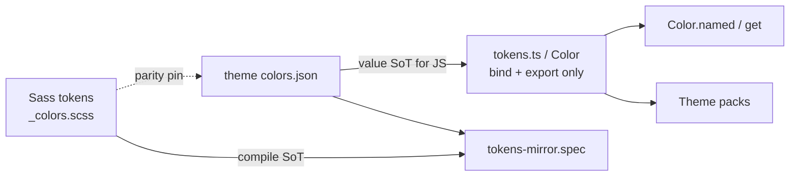

# Theme Color Coherence - Plan

## Goal Capsule

**Objective:** Make `@tgmc/theme` color surfaces coherent — complete Sass↔JSON color parity with nothing removed, JSON-backed JS mirrors (no hex/rgb literals in TS for inventoried colors), harden `Color` name lookup (unknown → null) and `Theme` get (unknown → undefined), then bump package semver.

**Product authority:** Theme package library coherence only. Style studio, Personalize quick-apply, and named personalization setups are surrounding work, not active scope.

**Open blockers:** None.

**Stop:** Do not invent Sass→JS codegen pipelines beyond importing generated JSON. Do not expand parity into app `--portfolio-*`. Do not redesign PrimeVue presets or personalization UX here. Do not mirror entire Sass hue-scale / grey-ramp matrices this increment. Named catalogs (`colors_2.json` + `extended-colors.json`) are in scope for inventory build.

**Execution profile:** Inventory and JSON library first; pin tests before changing `Color.get` miss semantics; smoke theme package vitest + docs.

**Product Contract preservation:** changed — R2 and Key Decisions updated for JSON-backed JS values (user-confirmed plan-time synthesis); R1, R3–R6 intent preserved. Deferred planning questions resolved as KTD1–KTD4.

---

## Product Contract

### Summary

Inside `@tgmc/theme`, finish Sass↔JSON parity for the inventoried color set (nothing removed; pin-tested). TypeScript color modules only bind/export from JSON — no string/number color literals for inventoried values. `Color.get` / `Color.named` support single-color lookup (unknown → null); `Theme` supports named themes/packs (unknown get → undefined). Bump package semver for the public API change.

### Key Decisions

- **Parity inventory before API hardening** (session-settled: user-directed — chosen over harden-APIs-first and a shared in-TS name catalog): lookup must not invent names missing from Sass or JSON. Governs R1, R2, R3.
- **JSON value library; JS binds only** (session-settled: user-directed — chosen over hand-literal hex in `tokens.ts`): color string/number values live in JSON; TS declares imports and typed exports only. Governs R2, R3.
- **Parity lock via Sass ↔ JSON pins; codegen deferred** (session-settled: user-directed — chosen over generating Sass from JSON or JSON from Sass this plan): Sass remains compile-time SoT; JSON is the JS-side value store; pin tests fail on drift. Governs R1, R2.
- **Theme package JSON home** (session-settled: user-approved — confirmed plan synthesis): own the library under `@tgmc/theme`, aligning from `core/web/content/colors.json` where it overlaps inventoried theme colors. Governs R2.
- **Inventory tier = existing JS-mirrored maps** (session-settled: user-approved — confirmed plan synthesis): roles, base, semantic, palettes, mode CSS vars — not full Sass hue-scale ramps. Governs R1, R2.
- **Theme package only** (session-settled: user-directed — chosen over theme+app portfolio parity): app `--portfolio-*` inventory is out. Governs R1.
- **`Color` = single-color lookup; `Theme` = named themes/packs** (session-settled: user-directed — chosen over a separate ColorCollection type). Governs R3, R4.
- **Unknown Color get/lookup → null** (session-settled: user-directed — chosen over throw or env-split): replaces today's `Color.get` black fallback. Governs R3.
- **Unknown Theme get → undefined** (session-settled: user-approved — keep current `Theme.get` miss): soft-miss without changing return type to null. Governs R4.
- **Apply remains fail-hard** (session-settled: user-approved — confirm kept current `Theme.select` throw on unknown): soft-miss is get/lookup only. Governs R4.
- **Theme package semver `0.0.1` → `0.1.0`** (session-settled: user-approved — confirmed plan synthesis): breaking null-miss + JSON-backed public surface under 0.x. Governs R5.

### Requirements

**Parity**

- R1. Every color in the inventoried set (KTD2: existing JS-mirror tier, reconciled to Sass SoT — not full Sass hue-scales) remains available; no color is removed as part of this work.
- R2. Every inventoried Sass color has a matching JSON entry (and reverse for the inventoried JSON set), same name and value; pin tests fail on drift. JS modules import that JSON and export typed bindings — they must not embed hex/rgb string or number literals for those inventoried colors. Extend the existing tokens-mirror suite rather than replacing it.

**Lookup APIs**

- R3. `Color.get(role, mode)` returns theme-role colors; `Color.named(name, mode?)` resolves flat JSON keys (base, semantic, palette swatches, mode roles). Unknown names return null (not a black fallback).
- R4. `Theme` supports listing and getting named themes and color packs; unknown get-by-name returns undefined without throwing; applying an unknown name may still fail hard.

**Packaging & docs**

- R5. When this work changes the public `@tgmc/theme` surface, the package version is bumped (`0.0.1` → `0.1.0` per Key Decision).
- R6. Theme package docs describe the Sass↔JSON parity rule, JSON-backed JS bindings, Color name lookup, Theme named packs, and miss semantics.

### Acceptance Examples

- AE1. Covers R1, R2. Given the inventoried Sass-aligned expected values and JSON-backed JS exports, a pin test fails if any inventoried name is missing or values differ; TS mirror modules contain no `#` / `rgb(` literals for inventoried color values (computed `--button-fg` and non-color keys excluded).
- AE2. Covers R3. Known `Color.get` role and `Color.named` JSON key return values; unknown names return null.
- AE3. Covers R4. Given a registered theme/pack name, Theme get returns its snapshot; given an unknown name, get returns undefined without throwing.
- AE4. Covers R5. After public API changes land, `@tgmc/theme` package version is `0.1.0`.

### Scope Boundaries

**In scope**

- `@tgmc/theme` JSON color library + Sass pin coverage for inventoried maps (roles, base, semantic, palettes, mode CSS vars)
- TS modules that bind/export from JSON without color literals
- Color `get` / `named` miss → null
- Theme named theme/pack list and get miss → undefined (tests/docs; behavior already exists)
- Package semver bump + docs

**Deferred for later**

- Sass→JSON or JSON→Sass codegen as the sole SoT
- App `--portfolio-*` Sass↔JS parity
- Full Sass hue-scale / grey-ramp matrices and `extended-colors.json` catalog
- Style studio page, Personalize as thin quick-apply, named setups + live draft, custom-storage setups persistence

**Outside this product's identity**

- Foundation `@import` silence-migration / Sass compiler pinning as the primary deliverable
- Cloud or account-synced personalization
- PrimeVue preset redesign

<!-- ce-section: work-relationships -->

### How This Work Fits Together

This plan owns **theme color coherence** only. Broader personalization/style work from the same conversation is the current understanding of surrounding outcomes, not a committed roadmap:

- **Style experience (studio + Personalize + named setups)** — Depends on Color name lookup and Theme named packs from this plan; Can proceed independently of Sass↔JSON parity once those APIs exist, but benefits from a complete inventory. Still to decide in a later brainstorm/plan.
- **App portfolio color parity** — Can proceed independently of this plan; Shares the “no color removed / pin on drift” product rule but targets a different surface.

### Outstanding Questions

**Deferred to Planning** — resolved in Planning Contract (KTD1–KTD4).

---

## Planning Contract

### Key Technical Decisions

- KTD1. **JSON path & build wiring** — Canonical file `theme/core/src/colors.json`. Enable `resolveJsonModule` in `theme/core/tsconfig.lib.json`; ensure Nx/`tsc` copies JSON into `dist/` (assets or equivalent) so consumers resolving `theme/core/dist` load the file. Align overlapping entries from `core/web/content/colors.json` (palette/common only — never copy divergent web `theme.light`/`dark`); do not pull `extended-colors.json`. (session-settled: user-approved — theme package home)
- KTD2. **Inventory boundary** — Inventoried set = `baseColors`, `semanticColors`, `themeColors` light/dark, `palettes.*`, and keys on `lightCssVariables` / `darkCssVariables` that carry static color values. Keep `--button-fg` **computed in TS** (`resolveButtonForeground`) and pin it in tests — exclude from JSON. Hue-scale Sass families without JS twins today stay out. (session-settled: user-approved)
- KTD3. **Color API shape** — Keep typed `Color.get(role, mode): string | null` (remove black fallback). Keep structured `Color.lookup`. Add `Color.named(name, mode?): string | null` with flat-index precedence base → semantic → palette swatch → mode role (mode required for role names). Role branch of `lookup` must not reintroduce black fallback. (session-settled: user-approved — named + null get)
- KTD4. **Semver** — Manual bump `theme/core/package.json` `0.0.1` → `0.1.0` (theme packages are not auto-bumped by root CD). Document breaking null-miss in theme docs. (session-settled: user-approved)

### Assumptions

- Web `colors.json` is content/catalog-shaped and may diverge from live theme tokens; theme JSON is authoritative for `@tgmc/theme` runtime after this work. Web may keep or later re-point content — not required for theme vitest green.
- Computed Sass values already pinned (accent complementary, primary-hover parchment/ink) remain pin-tested; their JSON entries store the agreed resolved hex, not a formula.

### High-Level Technical Design

### Sequencing

1. U1 inventory + JSON library
2. U2 TS binds (no literals)
3. U3 parity pin expansion
4. U4 Color null + named
5. U5 Theme get coverage
6. U6 semver + docs

---

## Implementation Units

### U1. Theme JSON color library + inventory

**Goal:** Own an inventoried JSON color library under `@tgmc/theme`, aligned with existing Sass/JS maps and overlapping `core/web/content/colors.json` entries; no color removed from the inventoried set.

**Requirements:** R1, R2

**Dependencies:** None

**Files:**

- Create: `theme/core/src/colors.json`
- Modify: `theme/core/package.json` (exports + dist assets), `theme/core/tsconfig.lib.json` (`resolveJsonModule`)
- Reference: `theme/core/scss/tokens/_colors.scss`, `core/web/content/colors.json` (align palette/common only; do not delete web catalog in this unit unless unused and explicitly safe)

**Approach:**

1. Enumerate inventoried keys from current `tokens.ts` maps and Sass roles/palettes/base/semantic/CSS color vars (KTD2).
2. Author `theme/core/src/colors.json` with the same names/values; reconcile drift toward Sass SoT.
3. Where `core/web/content/colors.json` overlaps (palettes, common), align names to theme camelCase; never copy web light/dark surfaces that diverge from Sass.
4. Wire `resolveJsonModule` + dist asset copy so JSON is loadable from `theme/core/dist`.
5. Document inventory boundary for U6.

**Patterns to follow:** Structure similar to `core/web/content/colors.json` theme/common sections; Sass SoT rule in `docs/packages/theme.md`.

**Test scenarios:**

- Happy path: JSON parses and contains every inventoried key expected by U3 pin table.
- Edge: overlapping web content names that differ in casing (e.g. `midnightVioletDark` vs `midnightVioletDk`) are normalized to one theme-canonical name without dropping a hex.
- Test expectation: fixture/assert inventory completeness in `theme/core/tests/` (may land with U3 if shared table).

**Verification:** Inventoried JSON exists at `theme/core/src/colors.json`, is included in dist, and lists all inventoried-set keys; no inventoried Sass color deleted.

---

### U2. JS mirrors bind JSON only (no color literals)

**Goal:** `tokens.ts` (and related mirror modules) export typed color maps by importing JSON — no hex/rgb string or number literals for inventoried colors.

**Requirements:** R2

**Dependencies:** U1

**Files:**

- Modify: `theme/core/src/tokens.ts`
- Modify: `theme/core/src/index.ts` / `theme/core/src/tokens-public.ts` if exports change
- Test: `theme/core/tests/tokens-mirror.spec.ts` (or new `tokens-no-literals.spec.ts`)

**Approach:**

1. Replace inline `baseColors`, `palettes`, `semanticColors`, `themeColors`, and static color entries in mode CSS maps with bindings from `colors.json`.
2. Keep non-color structural typing, helpers (`hexToRgb`, etc.), and **computed** `--button-fg` via `resolveButtonForeground` in TS.
3. Add a contract test that inventoried color bindings in `tokens.ts` do not embed `#` / `rgb(` literals (allow computed helpers and non-color keys; do not naively scan the whole file for `rgba`/`color-mix`).
4. Prefer typed `satisfies` / interface over bare JSON widenings so public key types stay sharp.

**Execution note:** Prefer a simple import + typed `as const` / satisfies pattern; avoid codegen.

**Patterns to follow:** Existing `tokens.ts` export names so Theme/Color call sites keep working.

**Test scenarios:**

- Happy path: exported `themeColors.light.primary` equals JSON and prior Sass-pinned value.
- Edge: mode CSS maps still omit layout ratio/breakpoint keys.
- Contract: inventoried color values in `tokens.ts` have no `#` / `rgb(` literals (computed `--button-fg` excluded).

**Verification:** Theme package builds; existing mirror smoke expectations still pass once U3 expands pins.

---

### U3. Extend Sass↔JSON parity pins

**Goal:** Extend `tokens-mirror.spec.ts` so inventoried Sass and JSON (via JS exports) cannot drift.

**Requirements:** R1, R2 · Covers AE1

**Dependencies:** U1, U2

**Files:**

- Modify: `theme/core/tests/tokens-mirror.spec.ts`
- Optional: `theme/core/tests/scss-color-fns.spec.ts` pattern for one Sass compile probe on computed accent / primary-hover

**Approach:**

1. Pin full objects for `palettes`, `baseColors`, `semanticColors`, `themeColors`.
2. Pin every color-bearing key on light/dark CSS variable maps.
3. Keep intentional omissions (layout keys) asserted as absent.
4. Optionally compile-probe Sass-computed accent/hover against JSON.

**Patterns to follow:** Existing `tokens-mirror.spec.ts` fixture style; do not require JS↔Sass output parity for `theme-*` manipulate helpers (color-fns plan).

**Test scenarios:**

- Covers AE1. Missing JSON key or hex mismatch fails the suite.
- Happy path: all four palette packs equal Sass-aligned values.
- Edge: `--primary-color` equals `themeColors.*.primary` for both modes.
- Edge: layout keys remain absent from mode maps.

**Verification:** `nx` / vitest theme package tests green for mirror suite.

---

### U4. Color null-miss + `Color.named`

**Goal:** Typed `Color.get` returns null on miss; add `Color.named` over the JSON library; fix `lookup` role branch.

**Requirements:** R3 · Covers AE2

**Dependencies:** U1, U2

**Files:**

- Modify: `theme/core/src/color.ts`
- Modify: `theme/core/tests/color-facade.spec.ts`
- Modify: `theme/core/src/index.ts` if export surface changes

**Approach:**

1. Remove `|| baseColors.black` from `Color.get`; return type `string | null`.
2. Route `lookup` role branch through null-safe get/`getThemeColor`.
3. Implement `Color.named` against JSON flat index (base → semantic → palette swatches → mode roles).
4. Update `primaryColors` / deprecated `getThemeColor` for nullability.

**Patterns to follow:** Existing `Color.lookup` exhaustive switch; `getThemeColor` in `tokens.ts` already returns `string | null`.

**Test scenarios:**

- Covers AE2. Known role/name returns hex; unknown returns null.
- Happy path: `Color.named('darkAmethyst')` (or canonical path) resolves palette swatch.
- Edge: `Color.lookup({ kind: 'role', name: … })` never returns `#000000` for unknown.
- Edge: kebab-case input normalizes when supported.

**Verification:** color-facade specs green; no black-fallback assertions remain.

---

### U5. Theme named get soft-miss coverage

**Goal:** Confirm `Theme.get` soft-miss and document select fail-hard; add missing tests.

**Requirements:** R4 · Covers AE3

**Dependencies:** None (behavior largely exists); sequence after U4 for docs consistency

**Files:**

- Modify: `theme/core/src/theme.ts` (JSDoc only if needed)
- Modify: `theme/core/tests/theme-singleton.spec.ts`

**Approach:**

1. Assert `Theme.get('missing')` is `undefined` without throw.
2. Keep `Theme.select('missing')` throws.
3. Ensure `list` includes builtins + registered packs.

**Test scenarios:**

- Covers AE3. Unknown get does not throw; returns `undefined`.
- Happy path: `get('light')` returns a token map snapshot.
- Edge: select unknown still throws `Unknown theme`.

**Verification:** theme-singleton specs green.

---

### U6. Semver bump + docs

**Goal:** Publish `0.1.0` and document Sass↔JSON rule, binding rule, lookup miss semantics.

**Requirements:** R5, R6 · Covers AE4

**Dependencies:** U1–U5

**Files:**

- Modify: `theme/core/package.json`
- Modify: `docs/packages/theme.md`
- Modify: `theme/core/README.md` (short pointer if present)
- Optional: `CONCEPTS.md` (JSON color library term — if not already added)

**Approach:**

1. Bump version to `0.1.0`.
2. Rewrite Sass ↔ JS sync section to Sass ↔ JSON ↔ JS bindings; change order: Sass first → JSON → TS bind → pins.
3. Document `Color.named`, null miss, Theme get vs select.

**Test scenarios:**

- Covers AE4. `package.json` version is `0.1.0`.
- Test expectation: none for README prose beyond optional link check — docs reviewed in PR.

**Verification:** Docs match shipped API; version field updated.

---

## Verification Contract

- Theme package vitest green (`tokens-mirror`, `color-facade`, `theme-singleton`, any new no-literals / inventory tests).
- Theme package build / `tsc` succeeds.
- Inventoried mirror TS sources contain no hex/rgb literals for color values.
- `@tgmc/theme` version is `0.1.0`.
- `docs/packages/theme.md` documents Sass↔JSON parity, JSON-backed bindings, and miss semantics.

## Definition of Done

- U1–U6 landed on a feature branch and PR’d into `development` (never direct-push `development`/`main`).
- Product Contract R1–R6 and AE1–AE4 satisfied.
- Style studio / setups / app portfolio parity remain out of the PR. Named catalogs are in via `build-colors-json.mjs`.

---

## Risks & Dependencies

| Risk                                                           | Mitigation                                                                                    |
| -------------------------------------------------------------- | --------------------------------------------------------------------------------------------- |
| `colors.json` (web) diverges from live theme tokens            | Theme JSON is authoritative for `@tgmc/theme`; align overlaps only; defer web content cleanup |
| Ban on TS literals fights `rgba` / `color-mix` / `--button-fg` | Scope no-literals to inventoried static colors; keep `--button-fg` computed (KTD2)            |
| Inventory under-scoped vs “every Sass color”                   | Explicit inventoried set in KTD2; hue-scales deferred                                         |
| JSON import fails in dist                                      | U1 wires `resolveJsonModule` + dist asset copy (KTD1)                                         |

## Sources & Research

- Requirements: this artifact (ce-brainstorm Product Contract)
- Patterns: `theme/core/src/tokens.ts`, `color.ts`, `theme.ts`, `theme/core/tests/tokens-mirror.spec.ts`
- Prior plans: `docs/plans/2026-09-15-001-feat-theme-singletons-plan.md`, `docs/plans/2026-09-18-001-feat-theme-scss-color-fns-plan.md`
- Catalog reference: `core/web/content/colors.json` (shape/overlap only)
- Repo research: theme coherence patterns pass (inventory gap, `Color.named` recommendation, manual semver)
