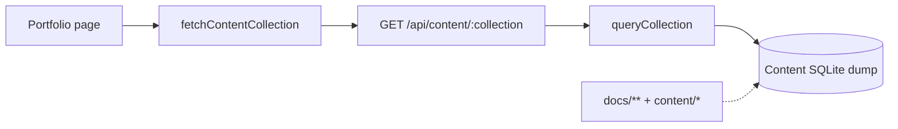
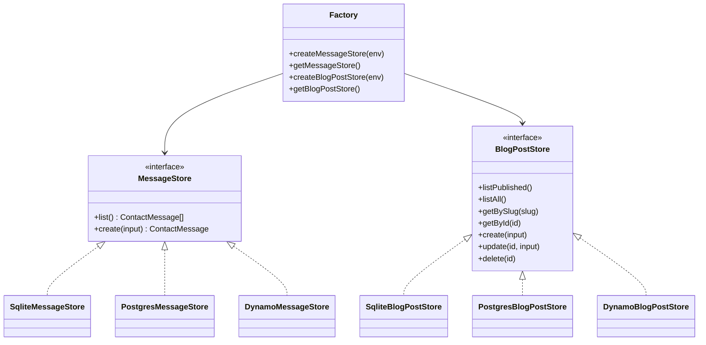
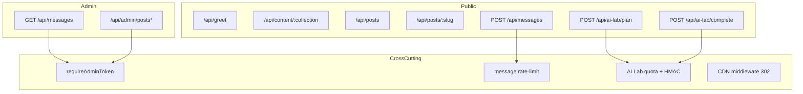

# API and store UML

HTTP surface and durable-store component model for `@tgmc/web`.

## Endpoint inventory

| Method | Path                       | Auth                 | Purpose                                                                                                                                    |
| ------ | -------------------------- | -------------------- | ------------------------------------------------------------------------------------------------------------------------------------------ |
| GET    | `/api/greet`               | none                 | Demo `{ message }`                                                                                                                         |
| GET    | `/api/content/:collection` | none                 | Content collections (`home`, `resume`, `product`, `gallery`, `code`, `writing`, `docs`, `caseStudies`, `decisionCards`); `mode=first\|all` |
| POST   | `/api/messages`            | none + IP rate limit | Create contact message                                                                                                                     |
| GET    | `/api/messages`            | Admin Bearer         | List messages                                                                                                                              |
| GET    | `/api/posts`               | none                 | List published posts                                                                                                                       |
| GET    | `/api/posts/:slug`         | none                 | Published post + rendered HTML                                                                                                             |
| POST   | `/api/ai-lab/plan`         | anonymous quota      | Idea → plan (live or replay)                                                                                                               |
| POST   | `/api/ai-lab/complete`     | continuation token   | Approved plan → brief                                                                                                                      |
| GET    | `/api/admin/posts`         | Admin Bearer         | List all posts                                                                                                                             |
| POST   | `/api/admin/posts`         | Admin Bearer         | Create post                                                                                                                                |
| GET    | `/api/admin/posts/:id`     | Admin Bearer         | Get by id                                                                                                                                  |
| PUT    | `/api/admin/posts/:id`     | Admin Bearer         | Update                                                                                                                                     |
| DELETE | `/api/admin/posts/:id`     | Admin Bearer         | Delete                                                                                                                                     |
| GET    | `/sitemap.xml`             | none                 | Sitemap                                                                                                                                    |
| GET    | `/robots.txt`              | none                 | Robots                                                                                                                                     |

Handlers live under `core/web/server/api/**` except admin posts (`packages/web-layer-admin`). Auth: `Authorization: Bearer <ADMIN_TOKEN>` via timing-safe compare; fail-closed if token empty. There are no end-user sessions or OAuth.

## Content API component view

Pages must not call client `queryCollection()` for portfolio data — see [page data loading](../features/page-data-loading.md).

## MessageStore / BlogPostStore UML

### Adapter selection

| `SYS_ENV` / store env | MessageStore               | BlogPostStore    |
| --------------------- | -------------------------- | ---------------- |
| `local`               | SQLite `data/local.sqlite` | SQLite           |
| `development`         | Postgres                   | Postgres         |
| `test` / `production` | DynamoDB `Messages`        | DynamoDB `Posts` |

`E2E_STORE_SYS_ENV` can override store selection (e.g. CI keeps public `SYS_ENV=test` while stores use SQLite). Factories: `core/web/server/db/index.ts`, `blog-store.ts`. Migrations: `server/db/migrations/001_messages.sql`, `002_posts.sql` via `npm run db:migrate:local`.

## API package diagram

## Related

- [Messages API](../features/messages-api.md)
- [Data stores](../data-stores.md)
- [Process sequences](./process-sequences.md)
- [Architecture hub](./architecture.md)
