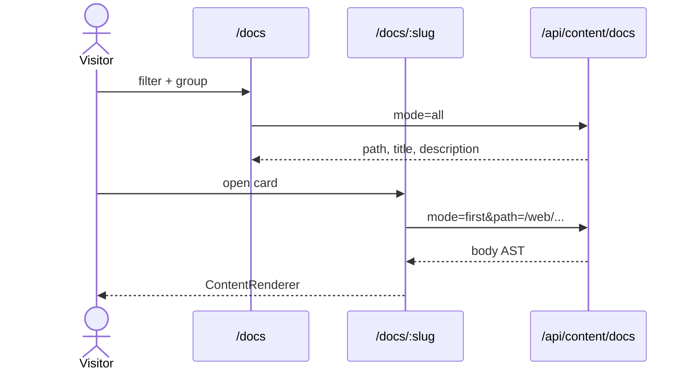

# Application architecture (example spec)

This page is an in-app technical spec example: narrative plus UML-style source. The live SVG diagram on [`/product`](/product) uses the same topology without a Mermaid runtime.

## Context

`@tgmc/web` is a Nuxt 4 app in an Nx monorepo. Page copy and case studies load through Nitro (`GET /api/content/:collection`) so client WASM SQLite is not used during SPA navigations.

## Container view

```mermaid
flowchart TB
  subgraph Client[Browser]
    Nav[AppPrimaryNav]
    Gallery[/gallery feed + grid]
    Docs[/docs catalog]
    Work[/work case studies]
  end
  subgraph Nitro[Nitro server]
    Api["/api/content/:collection"]
    Content[(Content SQLite)]
  end
  subgraph Repo[Repository]
    GalleryJson[content/gallery.json]
    DocsTree["docs/**/*.md"]
    Cases[content/case-studies]
  end
  Nav --> Gallery
  Nav --> Docs
  Nav --> Work
  Gallery --> Api
  Docs --> Api
  Work --> Api
  Api --> Content
  GalleryJson --> Content
  DocsTree --> Content
  Cases --> Content
```

## Sequence: open a spec



## Related

- [Page data loading](../features/page-data-loading.md)
- [Gallery and docs hubs](../features/gallery-and-docs.md)
- [Project structure](./project-structure.md)
