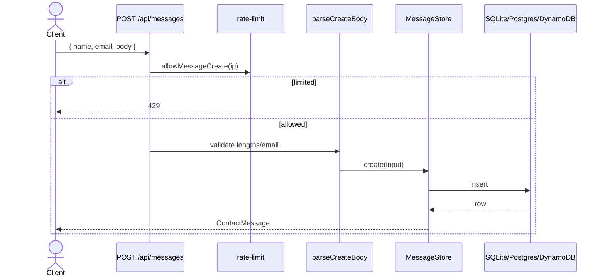
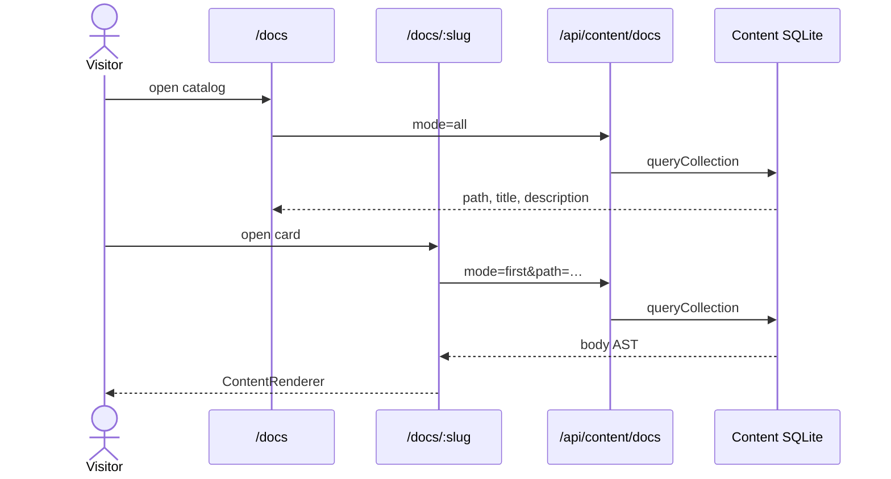
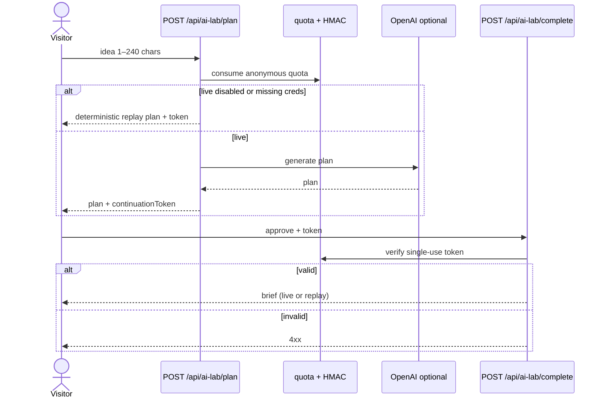
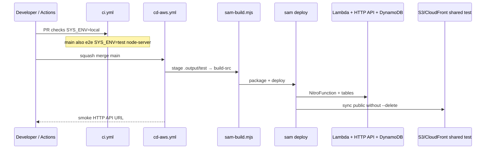
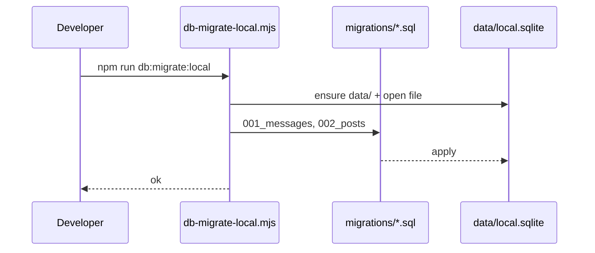
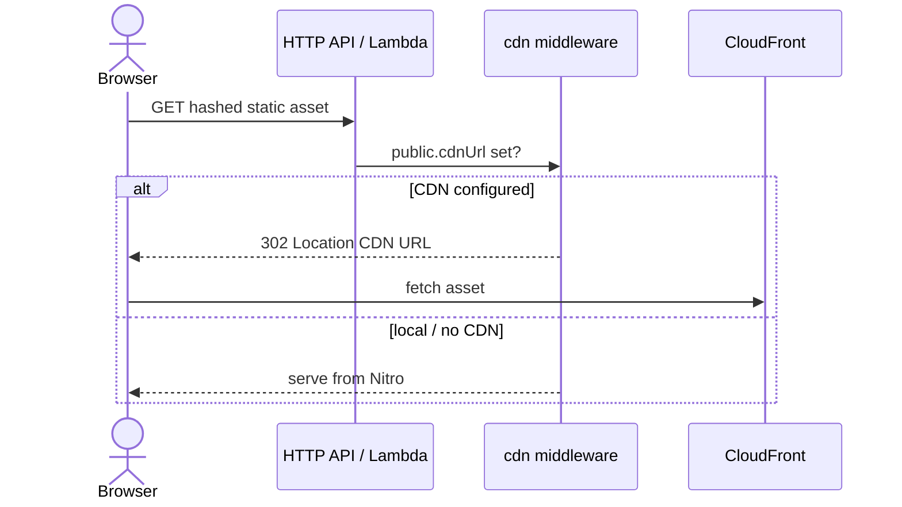

# Process sequences (UML)

Sequence diagrams for non-trivial flows. Pair with [API & store UML](./api-uml.md) and [System C4](./system-c4.md).

## A. Contact message create

Primary visitor contact is mailto; this API is available with IP rate limiting (5/hour in-memory).

## B. Open an in-app docs page

## C. AI Lab plan → complete

## D. SAM test deploy (high level)

## E. Local DB migrate

## F. CDN static asset redirect (test/prod)

## Related

- [Messages API](../features/messages-api.md)
- [CI/CD](../../cicd.md)
- [Infra](../../infra.md)
- [Architecture hub](./architecture.md)
