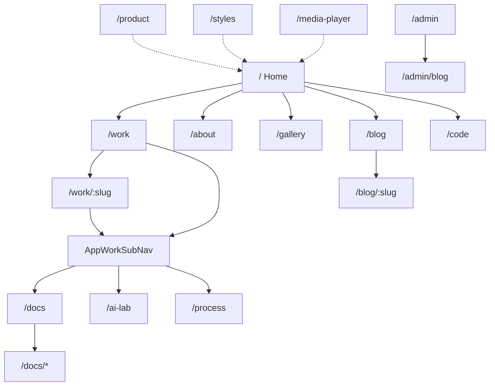

# Site wireframes

Low-fidelity page frames for the public portfolio chrome. Most routes use layout `default` → `site` (`AppPrimaryNav`, skip link, footer, personalize). Admin uses the `web-layer-admin` layer chrome.

## Site map



Primary nav (`AppPrimaryNav`): Work, About, Gallery, Writing (`/blog`), Code, plus mailto contact.

Work sub-nav (`AppWorkSubNav` on `/work` and `/work/[slug]`): Docs, AI Lab, Process.

## Shared chrome wireframe

```text
┌──────────────────────────────────────────────────────────────┐
│ skip link                                                    │
│ [Brand / Home]   Work  About  Gallery  Writing  Code  Contact│
├──────────────────────────────────────────────────────────────┤
│                                                              │
│                     PAGE BODY (one job)                      │
│  (on /work*: Related Docs · AI Lab · Process sub-nav)        │
│                                                              │
├──────────────────────────────────────────────────────────────┤
│ footer · personalize                                         │
└──────────────────────────────────────────────────────────────┘
```

## Home `/`

```text
┌──────────────────────────────────────────────────────────────┐
│ NAV                                                          │
├──────────────────────────────────────────────────────────────┤
│  HERO (full-bleed)                                           │
│  Brand / name                                                │
│  One headline · one supporting line · CTA group              │
├──────────────────────────────────────────────────────────────┤
│  Optional below-fold sections (not first viewport clutter)   │
└──────────────────────────────────────────────────────────────┘
```

Content: Nuxt Content collection `home` via `/api/content/home`.

## Work index `/work` and detail `/work/:slug`

```text
┌─ /work ─────────────────────────┐  ┌─ /work/:slug ──────────────────┐
│ NAV                             │  │ NAV                            │
│ Related: Docs · AI Lab · Process│  │ Related: Docs · AI Lab · Process│
├─────────────────────────────────┤  ├────────────────────────────────┤
│ Title · short intro             │  │ Case study title               │
│ ┌────┐ ┌────┐ ┌────┐            │  │ Media / narrative blocks       │
│ │card│ │card│ │card│ → slug     │  │ Architecture / outcomes        │
│ └────┘ └────┘ └────┘            │  │ Back to /work                  │
└─────────────────────────────────┘  └────────────────────────────────┘
```

## Gallery `/gallery`

```text
┌──────────────────────────────────────────────────────────────┐
│ NAV                                                          │
├──────────────────────────────────────────────────────────────┤
│ Browse toolbar (filter / mode)                               │
│ Feed or grid of media samples                                │
└──────────────────────────────────────────────────────────────┘
```

## Docs `/docs` and `/docs/*`

```text
┌─ /docs ─────────────────────────┐  ┌─ /docs/* ──────────────────────┐
│ Catalog · group · filter        │  │ Spec title                     │
│ Card list → path                │  │ ContentRenderer body           │
│                                 │  │ Related links                  │
└─────────────────────────────────┘  └────────────────────────────────┘
```

Repo `docs/**/*.md` ingested in place (not copied into `core/web/content/`).

## AI Lab `/ai-lab`

```text
┌──────────────────────────────────────────────────────────────┐
│ Goal input (short idea)                                      │
│ → Plan preview (live OpenAI or deterministic replay)         │
│ → Approve                                                    │
│ → Brief output                                               │
└──────────────────────────────────────────────────────────────┘
```

APIs: `POST /api/ai-lab/plan`, `POST /api/ai-lab/complete`.

## Blog `/blog` and admin

```text
┌─ /blog ──────────────┐  ┌─ /admin/blog ─────────────────────┐
│ Published shelf      │  │ Bearer-gated list / editor        │
│ → /blog/:slug        │  │ CRUD via /api/admin/posts         │
└──────────────────────┘  └───────────────────────────────────┘
```

Public list/detail use `GET /api/posts` and `GET /api/posts/:slug`. Primary visitor contact remains **mailto**, not the messages form.

## Secondary routes

| Route           | Purpose                                      |
| --------------- | -------------------------------------------- |
| `/process`      | AI decision journal (`decisionCards`)        |
| `/about`        | CV / resume content                          |
| `/code`         | Repo explorer presentation                   |
| `/product`      | Product narrative + `AppArchitectureDiagram` |
| `/styles`       | Style kitchen sink                           |
| `/media-player` | `@tgmc/media-player` demo                    |
| `/cdn-test`     | CDN config probe                             |

## Related

- [Architecture hub](./architecture.md)
- [Gallery and docs](../features/gallery-and-docs.md)
