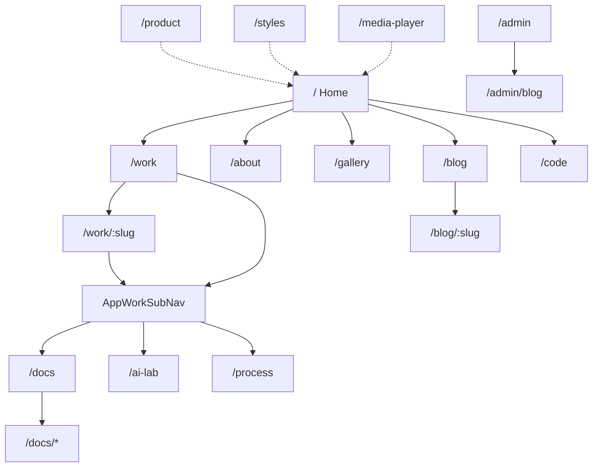

# Site wireframes

Low-fidelity page frames for the public portfolio chrome. Most routes use layout `default` → `site` (`AppPrimaryNav`, skip link, footer, personalize). Admin uses the `web-layer-admin` layer chrome.

## Site map



Primary nav (`AppPrimaryNav`): Work, About, Gallery, Writing (`/blog`), Code, plus mailto contact.

Work sub-nav (`AppWorkSubNav` on `/work` and `/work/[slug]`): Docs, AI Lab, Process.

## Shared chrome wireframe

```text
┌──────────────────────────────────────────────────────────────┐
│ skip link                                                    │
│ [Brand / Home]   Work  About  Gallery  Writing  Code  Contact│
├──────────────────────────────────────────────────────────────┤
│                                                              │
│                     PAGE BODY (one job)                      │
│  (on /work*: Related Docs · AI Lab · Process sub-nav)        │
│                                                              │
├──────────────────────────────────────────────────────────────┤
│ footer · personalize                                         │
└──────────────────────────────────────────────────────────────┘
```

## Home `/`, Work index `/work`, and Gallery `/gallery` — spatial redesign

Home, Work index, and Gallery ship the "spatial" direction from the Claude
Design handoff (`docs/packages/Portfolio design review/` chat transcripts): a
dark volumetric depth field (haze planes + particles traveling toward the
camera, mouse parallax) behind full-bleed IBM Plex Mono content, with the
shared nav/footer blended into the ground via `useSpatialPageChrome()` +
`assets/css/portfolio-spatial-chrome.scss` (keyed off `html[data-spatial-page]`).

- **Home** is the only one of the three that follows the site's light/dark
  toggle — its ink, accent, and depth-field colors invert for the light
  theme. Its hero is a drag-to-orbit ring of the featured case studies
  (cover-flow: the frontmost card focuses and reveals its caption, the rest
  recede in scale/blur/opacity), not a static image.
- **Work index** and **Gallery** only ship a dark treatment (no light variant
  in the handoff), so visiting either forces the real theme-mode system to
  `dark` for the duration (`useSpatialPageChrome(page, { forceDark: true })`)
  — this also keeps themed child components (PrimeVue dialogs, gallery
  code/viz exhibits) legible instead of just the hand-styled spatial classes.
- **Work sub-nav**: `AppWorkSubNav` (Related: Docs · AI Lab · Process) moved
  from the top-of-page aside to a small panel below the case-study list —
  the two-column `.page-with-nav` split reads oddly against a full-bleed
  dark hero, so it's now a single-column block restyled to sit on the ground
  (still the same component/links, `page-with-nav` class kept for the
  layout contract).
- `/work/:slug` (case study detail) is unchanged — still `data-fit="prose"`,
  still uses `.page-with-nav` as a sticky aside.

```text
┌──────────────────────────────────────────────────────────────┐
│ NAV (blended into the dark/light ground)                     │
├──────────────────────────────────────────────────────────────┤
│  Depth field (haze + particles, fixed, parallax on mouse)     │
│  HERO — Home: orbit ring · Work: title + jump bar             │
│         Gallery: title + view/filter toolbar                 │
├──────────────────────────────────────────────────────────────┤
│  Home: proof grid → principles → CTA                          │
│  Work: case-study cards (media rail + role/evidence) → related│
│  Gallery: tile grid or full-viewport snap feed → CTA          │
└──────────────────────────────────────────────────────────────┘
```

Home content: Nuxt Content collection `home` via `/api/content/home`. Work
and Gallery: `caseStudies` and `gallery` collections, unchanged.

## Docs `/docs` and `/docs/*`

```text
┌─ /docs ─────────────────────────┐  ┌─ /docs/* ──────────────────────┐
│ Catalog · group · filter        │  │ Spec title                     │
│ Card list → path                │  │ ContentRenderer body           │
│                                 │  │ Related links                  │
└─────────────────────────────────┘  └────────────────────────────────┘
```

Repo `docs/**/*.md` ingested in place (not copied into `core/web/content/`).

## AI Lab `/ai-lab`

```text
┌──────────────────────────────────────────────────────────────┐
│ Goal input (short idea)                                      │
│ → Plan preview (live OpenAI or deterministic replay)         │
│ → Approve                                                    │
│ → Brief output                                               │
└──────────────────────────────────────────────────────────────┘
```

APIs: `POST /api/ai-lab/plan`, `POST /api/ai-lab/complete`.

## Blog `/blog` and admin

```text
┌─ /blog ──────────────┐  ┌─ /admin/blog ─────────────────────┐
│ Published shelf      │  │ Bearer-gated list / editor        │
│ → /blog/:slug        │  │ CRUD via /api/admin/posts         │
└──────────────────────┘  └───────────────────────────────────┘
```

Public list/detail use `GET /api/posts` and `GET /api/posts/:slug`. Primary visitor contact remains **mailto**, not the messages form.

## Secondary routes

| Route           | Purpose                                      |
| --------------- | -------------------------------------------- |
| `/process`      | AI decision journal (`decisionCards`)        |
| `/about`        | CV / resume content                          |
| `/code`         | Repo explorer presentation                   |
| `/product`      | Product narrative + `AppArchitectureDiagram` |
| `/styles`       | Style kitchen sink                           |
| `/media-player` | `@tgmc/media-player` demo                    |
| `/cdn-test`     | CDN config probe                             |

## Related

- [Architecture hub](./architecture.md)
- [Gallery and docs](../features/gallery-and-docs.md)
