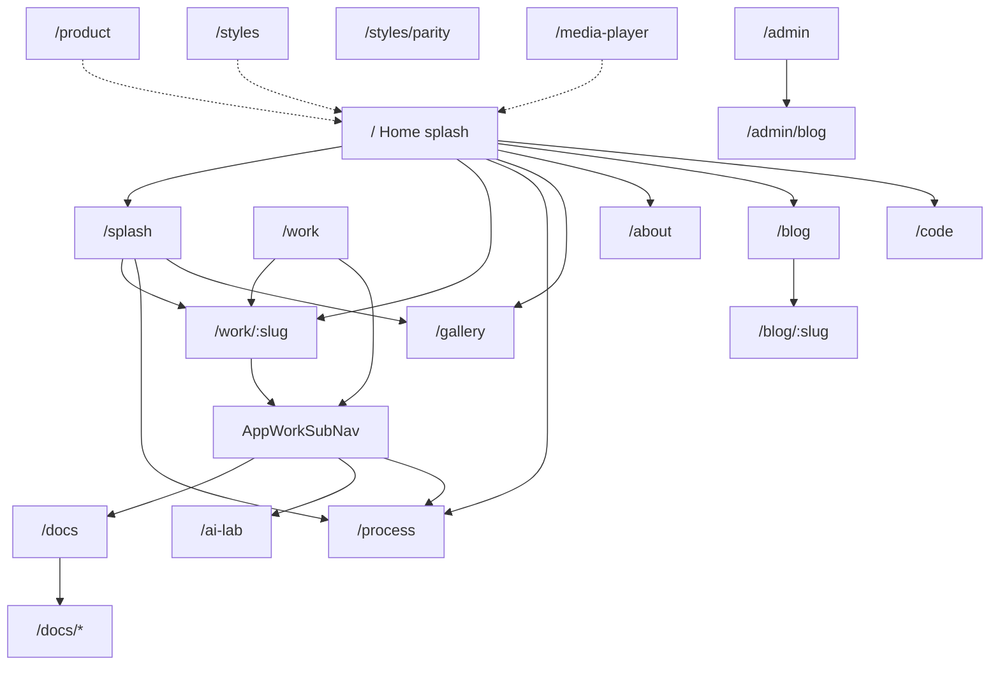

# Site wireframes

Low-fidelity page frames for the public portfolio chrome. Most routes use layout `default` → `site` (`AppPrimaryNav`, skip link, footer, personalize). Admin uses the `web-layer-admin` layer chrome.

## Site map


```mermaid
flowchart TB
  Home["/ Home splash"]
  Splash["/splash"]
  Work["/work"]
  WorkSlug["/work/:slug"]
  WorkSub["AppWorkSubNav"]
  Gallery["/gallery"]
  Docs["/docs"]
  DocsSlug["/docs/*"]
  AiLab["/ai-lab"]
  Process["/process"]
  About["/about"]
  Blog["/blog"]
  BlogSlug["/blog/:slug"]
  Code["/code"]
  Product["/product"]
  Styles["/styles"]
  Parity["/styles/parity"]
  Media["/media-player"]
  Admin["/admin"]
  AdminBlog["/admin/blog"]

  Home --> Splash
  Home --> WorkSlug
  Home --> Process
  Home --> Gallery
  Splash --> WorkSlug
  Splash --> Process
  Splash --> Gallery
  Home --> About
  Home --> Blog
  Home --> Code
  Work --> WorkSlug
  Work --> WorkSub
  WorkSlug --> WorkSub
  WorkSub --> Docs
  WorkSub --> AiLab
  WorkSub --> Process
  Docs --> DocsSlug
  Blog --> BlogSlug
  Admin --> AdminBlog
  Product -.-> Home
  Styles -.-> Home
  Media -.-> Home
```

Primary nav (`AppPrimaryNav`, list in `shared/primary-nav.ts`): Work, About, Gallery, Writing (`/blog`), Code — **inline from the tablet breakpoint (768 px)** with `aria-current="page"` and a link-colour underline; below 768 px they live in the Menu sheet. **Get in touch** is a visible header button (omitted on `/` and `/splash`). **Personalize** is a header icon button (“Personalize theme and background”) and no longer sits in the menu. When skip is on: **Doors** → `/splash` in the menu; **On view** (header actions, accessible name “On view: Media Systems”) → `/work/media-systems`. Brand Home stays `to="/"`.

Work sub-nav (`AppWorkSubNav` on `/work` and `/work/[slug]`): Docs, AI Lab, Process.

## Shared chrome wireframe

```text
┌──────────────────────────────────────────────────────────────┐
│ skip link                                                    │
│ [Brand] Work About Gallery Writing Code  [On view*] ◐ [Get in touch] │
│ <768px: [Brand] [On view*] ◐ Menu → sheet: links [Doors*] [mail*]    │
├──────────────────────────────────────────────────────────────┤
│                                                              │
│                     PAGE BODY (one job)                      │
│  (on /work*: Related Docs · AI Lab · Process sub-nav)        │
│                                                              │
├──────────────────────────────────────────────────────────────┤
│ footer · personalize                                         │
└──────────────────────────────────────────────────────────────┘
* On view + Doors only when skip is on. Mailto omitted on splash.
```

## Home `/` and splash `/splash`

```text
┌──────────────────────────────────────────────────────────────┐
│ [Brand / Home]                         [On view*]  Menu      │
│ (no Get in touch; no “Portfolio App” in the document title)  │
├──────────────────────────────────────────────────────────────┤
│  Heading / lede                                              │
│  [Continue from {title}          (Resume)]  (if previous)    │
│  Discovery  · 6 case studies → /work/media-systems           │
│  Process    · Decision cards → /process#agentic-ui-…         │
│  Exhibition · Gallery · browse freely → /gallery?specimen=…  │
│  ☐ Go straight to where I left off next time                 │
└──────────────────────────────────────────────────────────────┘
```

Content: Nuxt Content collection `home` via `/api/content/home`. `/` and `/splash` share `AppSplash`. Brand Home stays `to="/"`. Skip on: Doors in Menu → `/splash`; On view in header actions → `/work/media-systems`. Skip off: omit Doors and On view.

## Work index `/work` and detail `/work/:slug`

```text
┌─ /work ─────────────────────────┐  ┌─ /work/:slug ──────────────────┐
│ NAV                             │  │ NAV                            │
│ Related: Docs · AI Lab · Process│  │ Related: Docs · AI Lab · Process│
├─────────────────────────────────┤  ├────────────────────────────────┤
│ Title · short intro             │  │ Case study title               │
│ ┌────┐ ┌────┐ ┌────┐            │  │ Media / narrative blocks       │
│ │card│ │card│ │card│ → slug     │  │ Architecture / outcomes        │
│ └────┘ └────┘ └────┘            │  │ ← Prev story · Next story →    │
│ (whole card = one link)         │  │ [Get in touch]  All work       │
└─────────────────────────────────┘  └────────────────────────────────┘
```

## Gallery `/gallery`

```text
┌──────────────────────────────────────────────────────────────┐
│ NAV                                                          │
├──────────────────────────────────────────────────────────────┤
│ Browse toolbar: View | Group (counts) | Filter (counts)      │
│ Showing N of M posts · Clear filters   (state in ?group&kind)│
│ Feed or grid of media samples                                │
└──────────────────────────────────────────────────────────────┘
```

## Docs `/docs` and `/docs/*`

```text
┌─ /docs ─────────────────────────┐  ┌─ /docs/* ──────────────────────┐
│ Catalog · group · filter        │  │ Spec title                     │
│ Card list → path                │  │ ContentRenderer body           │
│                                 │  │ Related links                  │
└─────────────────────────────────┘  └────────────────────────────────┘
```

Repo `docs/**/*.md` ingested in place (not copied into `core/web/content/`).

## AI Lab `/ai-lab`

```text
┌──────────────────────────────────────────────────────────────┐
│ Goal input (short idea)                                      │
│ → Plan preview (live OpenAI or deterministic replay)         │
│ → Approve                                                    │
│ → Brief output                                               │
└──────────────────────────────────────────────────────────────┘
```

APIs: `POST /api/ai-lab/plan`, `POST /api/ai-lab/complete`.

## Blog `/blog` and admin

```text
┌─ /blog ──────────────┐  ┌─ /admin/blog ─────────────────────┐
│ Published shelf      │  │ Bearer-gated list / editor        │
│ → /blog/:slug        │  │ CRUD via /api/admin/posts         │
└──────────────────────┘  └───────────────────────────────────┘
```

Public list/detail use `GET /api/posts` and `GET /api/posts/:slug`. Primary visitor contact remains **mailto**, not the messages form.

## Secondary routes

| Route            | Purpose                                      |
| ---------------- | -------------------------------------------- |
| `/process`       | AI decision journal (`decisionCards`)        |
| `/about`         | CV / resume content                          |
| `/code`          | Repo explorer presentation                   |
| `/product`       | Product narrative + `AppArchitectureDiagram` |
| `/styles`        | Style Studio (brand roles, contrast guard)   |
| `/styles/parity` | Native / Foundation / PrimeVue kitchen sink  |
| `/media-player`  | `@tgmc/media-player` demo                    |
| `/cdn-test`      | CDN config probe                             |

## Related

- [Architecture hub](./architecture.md)
- [Gallery and docs](../features/gallery-and-docs.md)
