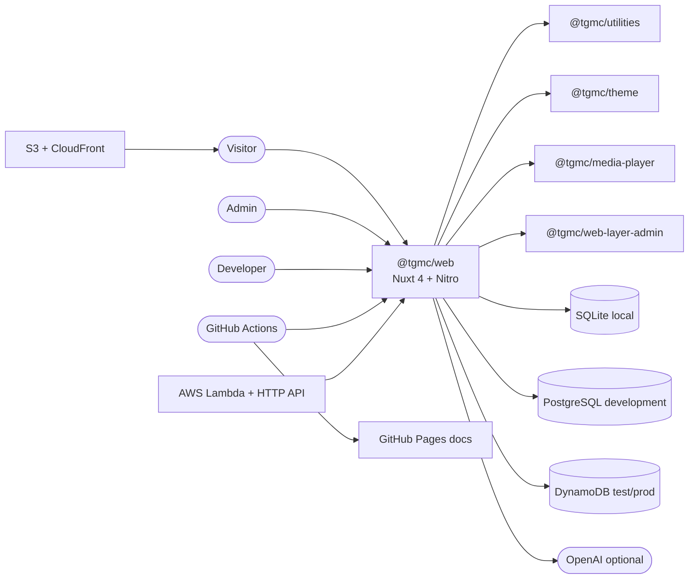
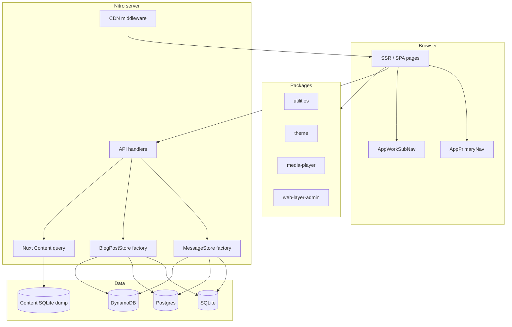
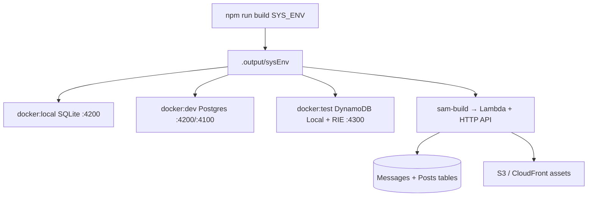

# System architecture (C4)

C4-style views of the portfolio site and surrounding systems. Source of truth: `core/web`, `packages/*`, `theme/core`, `infra/sam`, `docker/`.

## System context (Level 1)

### Actors

| Actor          | Role                                                               |
| -------------- | ------------------------------------------------------------------ |
| Visitor        | Portfolio surfaces: home, work, gallery, docs, AI Lab, blog, about |
| Admin          | Bearer-token `/admin/*` (blog CRUD; list messages)                 |
| Developer      | Local / Docker / SAM via root npm scripts                          |
| GitHub Actions | CI, SAM dry-run, test/prod deploy, Pages                           |
| OpenAI         | Optional AI Lab live mode when keys + `AI_LAB_LIVE_ENABLED`        |

## Containers (Level 2)

### Request path (typical page)

1. Browser hits Nuxt SSR/SPA route.
2. Page setup calls `fetchContentCollection` or `$fetch('/api/…')`.
3. Nitro handler under `core/web/server/api/**` (admin under `packages/web-layer-admin`).
4. Optional: admin Bearer check, message rate limit, AI Lab quota/HMAC.
5. Store factory or `queryCollection` → SQLite / Postgres / DynamoDB / Content dump.

## Deployment topology

| `SYS_ENV`     | Nitro preset  | Output                | Durable stores | How run                                |
| ------------- | ------------- | --------------------- | -------------- | -------------------------------------- |
| `local`       | `node-server` | `.output/local`       | SQLite         | `npm run dev` / `docker:local` `:4200` |
| `development` | `node-server` | `.output/development` | Postgres       | `docker:dev` web `:4200` + api `:4100` |
| `test`        | `aws_lambda`  | `.output/test`        | DynamoDB       | SAM test / `docker:test` `:4300`       |
| `production`  | `aws_lambda`  | `.output/production`  | DynamoDB       | SAM prod                               |

**Rules**

- SQLite/Postgres never back MessageStore/BlogPostStore on Lambda.
- Content on test/prod uses an in-memory dump restored from the Nitro output.
- Docker does **not** emulate S3/CDN; `docker:local` and `docker:dev` both use host `:4200` (exclusive).
- Test CDN is the shared HyperActivity stack; production uses stack-owned CloudFront.

## Package boundaries

| Import                      | Safe for              | Notes                                       |
| --------------------------- | --------------------- | ------------------------------------------- |
| `@tgmc/utilities`           | Nitro / Lambda / Node | No `window` / `localStorage` at module load |
| `@tgmc/utilities/browser`   | Client only           | Storage, DOM events, debounce/throttle      |
| `@tgmc/utilities/universal` | SSR + client          | CDN path helpers                            |
| `@tgmc/theme`               | Build + client tokens | Consumed from `theme/core/dist`             |
| `@tgmc/media-player`        | Client (`<video>`)    | Demo at `/media-player`                     |
| `@tgmc/likwidlibs`          | Generators            | Not a runtime site container                |

## Related

- [Architecture hub](./architecture.md)
- [API & store UML](./api-uml.md)
- [Data stores](../data-stores.md)
- [Infra](../../infra.md) · [Docker](../../docker.md) · [CI/CD](../../cicd.md)
